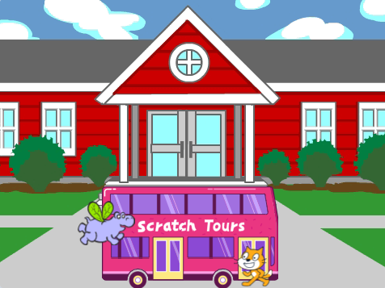

## Co będziesz robić

W tym projekcie stworzysz animację z duszkami, które biegną lub lecą, aby złapać autobus 🚌.

Co zrobisz:
+ Sprawisz, aby duszki robiły różne rzeczy `kiedy kliknięto zieloną flagę`{:class="block3events"}
+ Ustawisz duszki na **Scenie**
+ Użyjesz pętli `powtórz`{:class="block3control"} do `przesunięcia`{:class="block3motion"} duszków i `zmiany kostiumów`{:class="block3looks"}

--- no-print --- --- task ---

--- task ---

### Zagraj ▶️

  

Kliknij zieloną flagę, aby obejrzeć animację. 

Które duszki zmieniają kostiumy, aby uzyskać efekt animacji 🎥?

  <iframe allowtransparency="true" width="485" height="402" src="https://scratch.mit.edu/projects/embed/724160134/?autostart=false" frameborder="0"></iframe>

Co zrobisz:

--- /task --- --- /no-print ---

--- print-only ---

--- /print-only ---

**Animacja** tworzy efekt ruchu, szybko zmieniając zdjęcia. Pierwsi animatorzy rzeźbili obrazy z drewnianych klocków i używali ich jako pieczątek. Kodowanie animacji za pomocą Scratcha jest znacznie szybsze!

