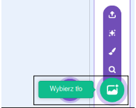
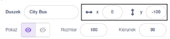
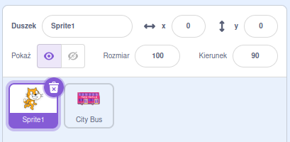

## Stwórz swoją scenę z autobusem

<div style="display: flex; flex-wrap: wrap">
<div style="flex-basis: 200px; flex-grow: 1; margin-right: 15px;">
Wybierzesz tło i dodasz duszka autobusu.
</div>
<div>

{:width="300px"}

</div>
</div>

--- task ---

Otwórz [projekt startowy Złap autobus](https://scratch.mit.edu/projects/582214330/editor){:target="_blank"}. Scratch otworzy się w nowej karcie przeglądarki.

[[[working-offline]]]

--- /task ---

--- task ---

Kliknij (lub naciśnij na tablecie) **Wybierz tło** w okienku Sceny (w prawym dolnym rogu ekranu):



--- /task ---

--- task ---

Kliknij kategorię **Na zewnątrz**. Dodaj tło, które będzie dobrym punktem wyjścia dla Twojego autobusu:


--- /task ---

--- task ---

Kliknij **Wybierz duszka**:


--- /task ---

--- task ---

Wpisz `bus` w polu wyszukiwania u góry:


Dodaj duszka **City Bus** do swojego projektu.

--- /task ---

 W Scratchu uruchamiasz projekty, klikając zieloną flagę nad sceną. Autobus musi znajdować się w pozycji początkowej `gdy zielona flaga została kliknięta`{:class="block3events"}.

--- task ---

Upewnij się, że **Autobus** jest wybrany na liście duszków pod sceną.

Przeciągnij `kiedy kliknięto zieloną flagę`{: class = "block3events"} blok z `Wydarzeń`{class = "block3events"} blokuje menu do obszaru kodu:


```blocks3
when flag clicked
```

--- /task ---

--- task ---

Przeciągnij autobus w dobrą pozycję na scenie:


Koordynaty **x** i **y** (liczby używane do opisania pozycji) autobusu są pokazane w panelu Sprite poniżej sceny:




--- /task ---

--- task ---

Dodaj blok `idź do x: y:`{:class="block3motion"}:


```blocks3
when flag clicked
+go to x: (0) y: (-100)
```

Liczby w bloku `idź do x:y:`{:class="block3motion"} są bieżącymi współrzędnymi x i y autobusu. Liczby w twoim projekcie mogą się nieco różnić.

--- /task ---

--- task ---

**Test:** Przeciągnij autobus w dowolne miejsce na scenie, a następnie kliknij zieloną flagę. Autobus powinien zawsze jechać do swojej pozycji początkowej.

--- /task ---

Kiedy przeciągasz autobus, jedzie on przed kota Scratch.

--- task ---

Aby upewnić się, że duszek **Autobus** jest zawsze za wszystkimi duszkami postaci, dodaj `przejdź do przedniej warstwy`{:class="block3looks"}, a następnie kliknij `przód`{:class="block3looks"} i zmień go na `tył`{:class="block3looks"}:


```blocks3
when flag clicked
go to x: (0) y: (-100)
+ go to [back v] layer
```

**Wskazówka:** Jeśli nie widzisz bloku`przejdź do pierwszej warstwy`{:class="block3looks"}, musisz przewinąć w dół w menu bloku`Wyglądy`{:class="block3looks"}.

--- /task ---

--- task ---

Możesz zmienić kolor autobusu:


```blocks3
when flag clicked
go to x: (0) y: (-100)
go to [back v] layer
+set [color v] effect to (50) // try numbers up to 200
```

--- /task ---

--- task ---

Kot Scratch pojawia się we wszystkich nowych projektach Scratch jako **Sprite1** na liście Duszków. Kliknij na **Sprite1** na liście Duszków, aby przygotować się do animowania kota Scratch:



**Wskazówka:** Jeśli przypadkowo usunąłeś duszka **Sprite1** (Scratch Cat), możesz kliknąć ikonę **Wybierz Duszka** i wyszukać `cat`.

--- /task ---

W tej chwili kot Scratch jest zbyt duży, aby zmieścić się w autobusie.

--- task ---

W panelu Duszek kliknij właściwość **Rozmiar** i zmień rozmiar kota Scratch na `50`:


--- /task ---

--- save ---
