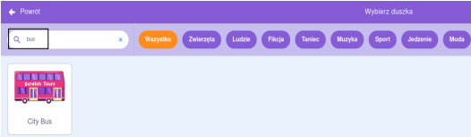
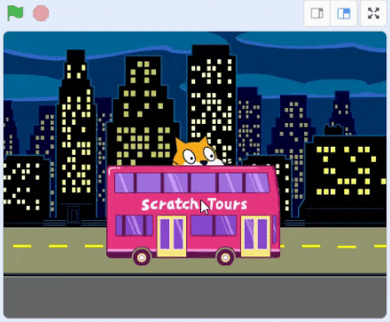
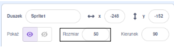

## Stwórz swoją scenę z autobusem

<div style="display: flex; flex-wrap: wrap">
<div style="flex-basis: 200px; flex-grow: 1; margin-right: 15px;">
Wybierzesz tło i dodasz duszka autobusu.
</div>
<div>

{:width="300px"}

</div>
</div>

### Otwórz projekt startowy

--- task ---

Otwórz [projekt startowy Złap autobus](https://scratch.mit.edu/projects/582214330/editor){:target="_blank"}. Scratch otworzy się w nowej karcie przeglądarki.

[[[working-offline]]]

--- /task ---

### Wybierz tło

--- task ---

Kliknij (lub naciśnij na tablecie) **Wybierz tło** w okienku sceny (w prawym dolnym rogu ekranu):


--- /task ---

--- task ---

Kliknij kategorię **Na zewnątrz**. Dodaj tło, które będzie dobrym punktem startowym dla Twojego autobusu:


--- /task ---

### Wybierz duszka

--- task ---

Kliknij **Wybierz duszka**:


--- /task ---

--- task ---

Wpisz `bus` w polu wyszukiwania u góry:



Dodaj duszka **City Bus** do swojego projektu.

--- /task ---

### Daj autobusowi pozycję startową

--- task ---

Upewnij się, że duszek **City Bus** jest zaznaczony na liście duszków pod sceną.

Przeciągnij blok `kiedy kliknięto zieloną flagę`{:class="block3events"} z menu `Zdarzenia`{:class="block3events"} do obszaru kodu:


```blocks3
when flag clicked
```

--- /task ---

--- task ---

Przeciągnij autobus na wybraną pozycję na scenie:


Koordynaty **x** i **y** (liczby używane do opisania pozycji) autobusu są pokazane w panelu duszka pod sceną:


--- /task ---

--- task ---

Dodaj blok `idź do x: y:`{:class="block3motion"}:


```blocks3
when flag clicked
+go to x: (0) y: (-100)
```

Liczby w bloku `idź do x: y:`{:class="block3motion"} są bieżącymi współrzędnymi x i y autobusu. Liczby te w twoim projekcie mogą się nieco różnić.

--- /task ---

--- task ---

**Test:** Przeciągnij autobus w dowolne miejsce na scenie, a następnie kliknij zieloną flagę. Autobus powinien zawsze znaleźć się w swojej pozycji początkowej.



--- /task ---

### Przesuń autobus za duszki postaci

--- task ---

Aby upewnić się, że duszek **City Bus** jest zawsze za wszystkimi duszkami postaci, dodaj blok `przesuń na wierzch`{:class="block3looks"}, a następnie kliknij `wierzch`{:class="block3looks"} i zmień go na `spód`{:class="block3looks"}:


```blocks3
when flag clicked
go to x: (0) y: (-100)
+ go to [tył v] layer
```

**Wskazówka:** Jeśli nie widzisz bloku `przesuń na wierzch`{:class="block3looks"}, przewiń w dół w menu bloków `Wygląd`{:class="block3looks"}.

--- /task ---

### Zmień kolor autobusu

--- task ---

Możesz zmienić kolor autobusu:


```blocks3
when flag clicked
go to x: (0) y: (-100)
go to [tył v] layer
+set [kolor v] effect to (50) // spróbuj liczb do 200
```

--- /task ---

### Zmień rozmiar kota Scratch

--- task ---

Kot Scratch pojawia się we wszystkich nowych projektach Scratch jako **Sprite1** na liście duszków. Kliknij duszka **Sprite1** na liście duszków, aby przygotować się do animowania kota Scratch:


**Wskazówka:** Jeśli duszek **Sprite1** (kot Scratch) został przypadkowo usunięty, możesz kliknąć ikonę **Wybierz duszka** i wyszukać `cat`.

--- /task ---

--- task ---

W panelu duszka kliknij właściwość **Rozmiar** i zmień rozmiar kota Scratch na `50`:



--- /task --- 
