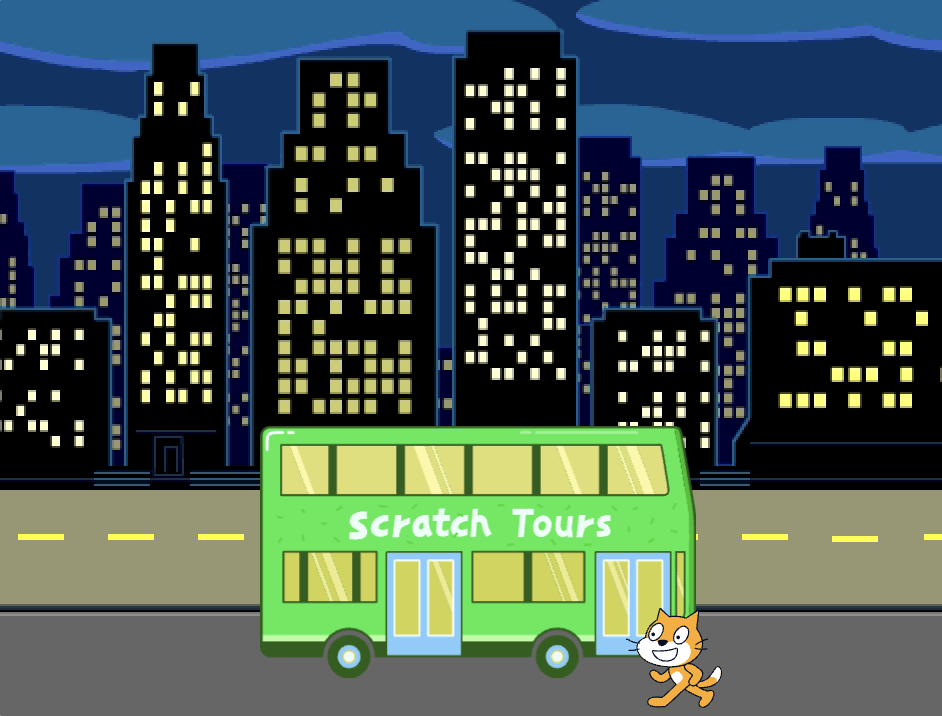
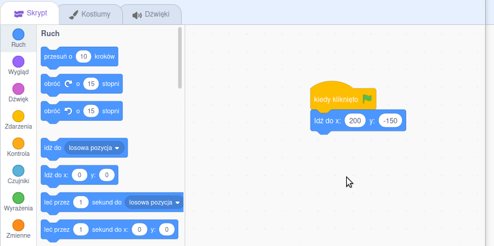

## Kot Scratch łapie autobus

<div style="display: flex; flex-wrap: wrap">
<div style="flex-basis: 200px; flex-grow: 1; margin-right: 15px;">
Będziesz animować kota Scratch, aby pojawił się po **prawej stronie** sceny i podszedł do autobusu, powtarzając kilka razy mały ruch w **pętli**. 
</div>
<div>

{:width="300px"}

</div>
</div>

### Ustaw kota Scratch w pozycji startowej

--- task ---

Kliknij właściwość **Kierunek** w panelu duszka. Obróć strzałkę tak, aby wskazywała `-90`. Następnie kliknij ikonę **lewo/prawo** pośrodku, aby zmienić styl obracania duszka na `lewy-prawy`, dzięki czemu kot Scratch przestanie odwracać się do góry nogami:


--- /task ---

--- task ---

Przeciągnij kota Scratch do prawej dolnej części sceny.


**Wskazówka:** Jeśli spróbujesz umieścić duszka poza sceną, wróci on do swojej ostatniej pozycji na scenie.

--- /task ---

--- task ---

Dodaj kod, aby ustawić kota Scratch w pozycji startowej:


```blocks3
when flag clicked
go to x:(200) y:(-150) // dolna prawa część
```

--- /task ---

--- task ---

**Test:** Przeciągnij kota Scratch do nowej pozycji, a następnie kliknij blok `przejdź do x: y:`{:class="block3motion"}. Kot Scratch powinien za każdym razem wrócić do prawego dolnego rogu.

--- /task ---

### Animuj kota Scratch

Dodasz kod w pętli `powtórz`{:class="block3control"}, aby kot Scratch powtórzył małą liczbę kroków wiele razy. Dzięki temu uzyskamy animację kota Scratch.

--- task ---

Dodaj blok `powtórz`{:class="block3control"} `10` `razy`{:class="block3control"}, a następnie przeciągnij blok `przesuń o`{:class="block3motion"} `10` `kroków`{:class="block3motion"} do środka pętli:




```blocks3
when flag clicked
go to x:(200) y:(-150) // dolna prawa część
+ repeat (10) // wypróbuj różne liczby
move (5) steps //  5 to dobra prędkość chodzenia
end
```

--- /task ---

--- task ---

**Test:** Kliknij zieloną flagę. Spróbuj zmienić liczbę w bloku `powtórz`{:class="block3control"} `10 razy`{:class="block3control"} tak, aby kot Scratch zatrzymał się przy autobusie.

--- /task ---

Niektóre duszki mają więcej niż jeden kostium. Wykorzystamy kostiumy **kota Scratch**, aby stworzyć animację jego ruchu.

--- task ---

Kliknij zakładkę **Kostiumy**. Duszek **kota Scratch** ma dwa kostiumy, które mogą być użyte do stworzenia animacji chodzenia duszka.

--- /task ---

--- task ---

Kliknij zakładkę **Skrypt**. Dodaj blok `następny kostium`{:class="block3looks"}:


```blocks3
when flag clicked
go to x:(200) y:(-150) // dolna prawa część
repeat (20) // wypróbuj różne liczby
move (5) steps //  5 to dobra prędkość chodzenia
+ next costume 
end
```
--- /task ---

--- task ---

**Test:** Kliknij zieloną flagę, a kot Scratch pójdzie do autobusu.

--- /task ---

### Ukryj kota Scratch

--- task ---

Dodaj blok `ukryj`{:class="block3looks"}, dzięki czemu kot Scratch zniknie, gdy dotrze do autobusu:


```blocks3
when flag clicked
go to x:(200) y:(-150) // dolna prawa część
repeat (20) // wypróbuj różne liczby
move (5) steps //  5 to dobra prędkość chodzenia
next costume 
end
+ hide
```

--- /task ---

--- task ---

**Test:** Kliknij ponownie zieloną flagę, a zobaczysz, że kot Scratch zniknął.

--- /task ---

### Pokaż kota Scratch

--- task ---

Dodaj blok `pokaż`{:class="block3looks"}, aby kot Scratch pojawił się, zanim zacznie iść do autobusu:


```blocks3
when flag clicked
go to x:(200) y:(-150) // dolna prawa część
+ show
repeat (20) // wypróbuj różne liczby
move (5) steps //  5 to dobra prędkość chodzenia
next costume 
end
hide
```

**Wskazówka:** Kiedy używasz `ukryj`{:class="block3looks"}, musisz również dodać blok `pokaż`{:class="block3looks"}, aby upewnić się, że duszek jest widoczny w tych momentach, kiedy jest to konieczne.

--- /task ---

--- task ---

**Test:** Kliknij zieloną flagę, aby przetestować swój projekt i upewnij się, że kot Scratch pojawia się.

--- /task ---

