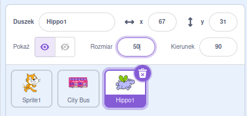

## Hipcio leci do autobusu

<div style="display: flex; flex-wrap: wrap">
<div style="flex-basis: 200px; flex-grow: 1; margin-right: 15px;">
Dodasz duszka hipopotama, który leci do autobusu.
</div>
<div>

{:width="300px"}

</div>
</div>

Duszkel ** Hippo1** ma dwa kostiumy ze skrzydłami w różnych pozycjach, dzięki czemu można go animować, aby leciał do autobusu.

--- task ---

Dodaj duszka ** Hippo1** do swojego projektu.

Zmień **Rozmiar** duszka **Hippo1**:



--- /task ---

--- task ---

Przeciągnij hipcia do lewej dolnej części sceny.


--- /task ---

--- task ---

Dodaj kod aby ustawić hipcia w pozycji wyjściowej:

```blocks3
when flag clicked
go to x: [-200] y: [150] // top left-hand side
```

**Wskazówka:** `x`{:class="block3motion"} i `y`{:class="block3motion"} w bloku `idź do x: y:`{:class="block3motion"} będą aktualna pozycja hipopotama, więc nie musisz ich wpisywać.

--- /task ---

Hipcio poleci w stronę autobusu, trzepocząc skrzydłami.

Hipcio będzie `ustawiony w kierunku`{:class="block3motion"} autobus przed ruszeniem się.

--- task ---

Dodaj kod, aby hipopotam leciał w kierunku **autobusu**:

```blocks3
when flag clicked
go to x: [-200] y: [150] 
+repeat [100] 
point towards (City Bus v) // change from mouse-pointer
move [3] steps
next costume
+end
```

--- /task ---

--- task ---

**Test:** Kliknij zieloną flagę i sprawdź, czy hipopotam leci do autobusu. Możesz zmienić liczbę w bloku `powtórz`{:class="block3control"}, aby hipopotam zatrzymał się we właściwym miejscu.

--- /task ---

Teraz hipopotam wejdzie do autobusu.

--- task ---

Dodaj bloki `pokaż`{:class="block3looks"} i `ukryj`{:class="block3looks"}:

```blocks3
when flag clicked
go to x: [-200] y: [150] 
+ show
repeat [90] 
point towards (City Bus v)
move [3] steps
next costume
end
+ hide
```

--- /task ---

--- task ---

**Test:** Kliknij zieloną flagę. Hipopotam poleci i wejdzie do autobusu.

--- /task ---

--- save ---
