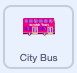

## Autobus odjeżdża

<div style="display: flex; flex-wrap: wrap">
<div style="flex-basis: 200px; flex-grow: 1; margin-right: 15px;">
Dodasz skrypt, dzięki któremu autobus odjedzie.
</div>
<div>

{:width="300px"}

</div>
</div>

### Animuj autobus

--- task ---

Wybierz duszka **City Bus**.



--- /task ---

--- task ---

Dodaj kod, dzięki któremu autobus odjedzie w prawo cztery sekundy po kliknięciu zielonej flagi.


```blocks3
when flag clicked 
wait [4] seconds // change 1 to 4
```

--- /task ---

--- task ---

Przeciągnij swój autobus na prawą stronę sceny. Będą to współrzędne `x`{:class="block3motion"} i `y`{:class="block3motion"}, do których autobus będzie `leciał`{:class="block3motion"}.


**Wskazówka:** Jeśli przesuniesz autobus zbyt daleko w prawo, wróci on na poprzednią pozycję. W takiej sytuacji spróbuj ponownie, ale tym razem nie przesuwaj go tak daleko.

--- /task ---

--- task ---

Dodaj blok `leć przez`{:class="block3motion"} `2` `sekund do x: y:`{:class="block3motion"} poniżej bloku `czekaj`{:class="block3events"}.

Współrzędne `x`{:class="block3motion"} i `y`{:class="block3motion"} w Twoim projekcie mogą być nieco inne.


```blocks3
when flag clicked 
wait [4] seconds // change 1 to 4
+glide [2] secs to x: [320] y: [-100] // right-hand side of the Stage
```

--- /task ---

--- task ---

**Test:** Kliknij zieloną flagę. Kot Scratch i Hipcio powinni dotrzeć i wsiąść do autobusu, który po czterech sekundach odjedzie w prawo.

--- /task ---

### Ukryj i pokaż autobus

--- task ---

Dodaj blok `ukryj`{:class="block3looks"}, aby wywołać wrażenie opuszczenia sceny przez autobus:


```blocks3
when flag clicked 
wait [4] seconds // change 1 to 4
glide [2] secs to x: [320] y: [-100]
+ hide
```
--- /task ---

--- task ---

**Test:** Kliknij zieloną flagę. Teraz autobus zniknie po odjeździe. Czy pamiętasz, jak sprawić, aby duszek pojawił się ponownie po kliknięciu zielonej flagi?

--- /task ---

--- task ---

Dodaj blok `pokaż`{:class="block3looks"} do swojego skryptu uruchomiającego się `kiedy kliknięto zieloną flagę`{:class="block3events"}, aby autobus pojawił się po uruchomieniu projektu:


```blocks3
when flag clicked
go to x: (0) y: (-100)
go to [back v] layer
set [color v] effect to (85) // try numbers up to 200
+show
```

--- /task ---

--- task ---

**Test:** Kliknij zieloną flagę i obejrzyj swoją animację. Autobus powinien pojawić się na środku sceny, a następnie odjechać w prawo i zniknąć.

Czy wszyscy są w autobusie, kiedy ten odjeżdża? W razie potrzeby możesz zmienić czas oczekiwania autobusu.

--- /task ---
