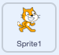
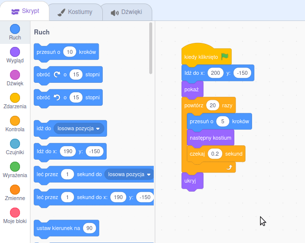

## Spóźnienie się na autobus

<div style="display: flex; flex-wrap: wrap">
<div style="flex-basis: 200px; flex-grow: 1; margin-right: 15px;">
Co jeśli kot Scratch nie pobiegł wystarczająco szybko, aby zdążyć na autobus?
</div>
<div>

{:width="300px"}

</div>
</div>

--- task ---

Wybierz duszka **kot Scratch** i dodaj `czekaj`{:class="block3control"}:



```blocks3
when flag clicked
go to x:(200) y:(-150) 
show
repeat (20) // wypróbuj różne liczby
move (5) steps 
next costume 
+ wait (1) seconds
end
hide
```
--- /task ---

--- task ---

**Test:** Kliknij zieloną flagę. Kot Scratch będzie szedł zbyt wolno i spóźni się na autobus!

--- /task ---

Będziesz potrzebować opóźnień krótszych niż jedna sekunda. 0,5 to pół sekundy, 0,25 to ćwierć sekundy, a 0,1 to dziesiąta część sekundy.

--- task ---

Zmień opóźnienie w `czekaj`{:class="block3control"}:


```blocks3
wait (0.2) seconds // spróbuj 0,1, 0,5, 0,05
```

**Test:** Kliknij zieloną flagę, a kot Scratch pójdzie szybciej. Wybierz opóźnienie, które najbardziej Ci się podoba.

--- /task ---

**Wybierz:** Wybierz, czy chcesz, aby kot Scratch**spóźnił się na autobus** lub **zdąży złapać autobus**.

--- task ---

Jeśli chcesz, aby kot Scratch**spóźnij się na autobus**, usuń `ukryj`{:class="block3looks"} z kodu, aby kot Scratch pozostał na scenie:




```blocks3
when flag clicked
go to x:(200) y:(-150) 
show
repeat (20) 
move (5) steps 
next costume
wait (0.5) seconds 
end
-hide
```
--- /task ---

--- task ---

Jeśli chcesz aby kot Scratch **złapał autobus** ustaw dłuższy czas oczekiwania autobusu:


```blocks3
+when [timer v] > [6] // zmiana z 4 na 6
glide [2] secs to x: [320] y: [-100] // prawa strona sceny
hide
```

Będziesz musiał umieścić kod `ukryj`{:class="block3looks"} z powrotem w **kot Scratch**, jeśli go usunąłeś i chcesz, aby kot Scratch z powodzeniem złapał autobus.

--- /task ---

--- task ---

Dokonuj zmian, aż animacja będzie działała tak, jak chcesz.

--- /task ---

<p style="border-left: solid; border-width:10px; border-color: #0faeb0; background-color: aliceblue; padding: 10px;">
Podczas pracy nad projektem często wracasz i zmieniasz lub ulepszasz swój kod w miarę pojawiania się nowych pomysłów. 
</p>

--- save ---


