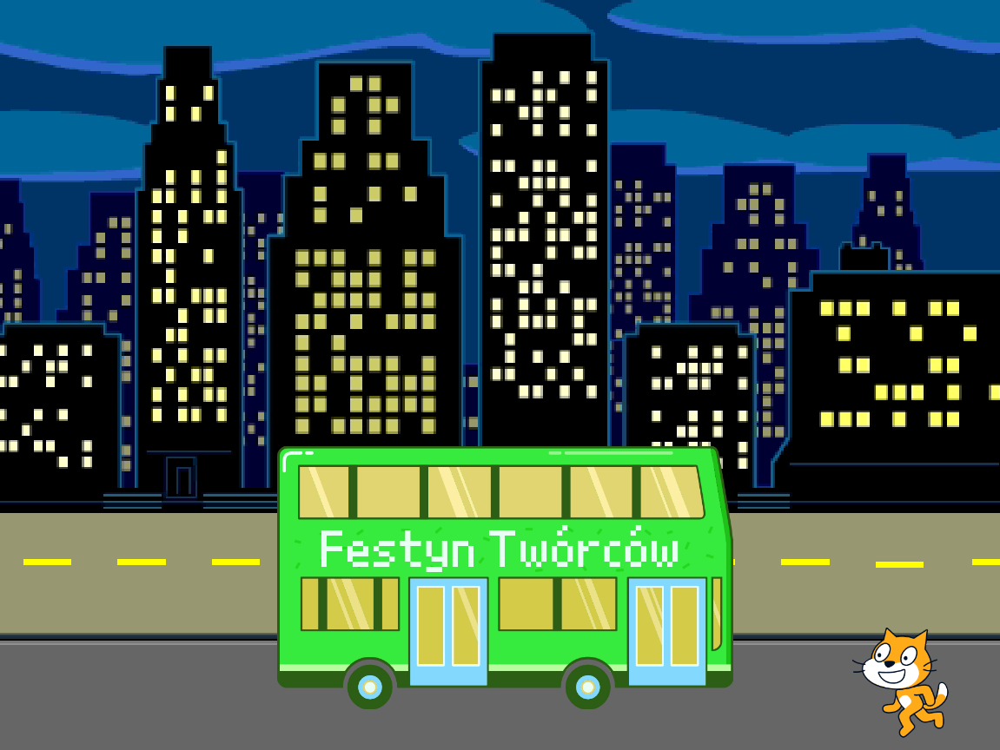
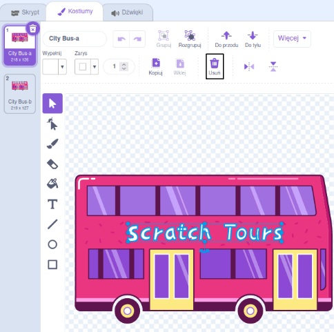
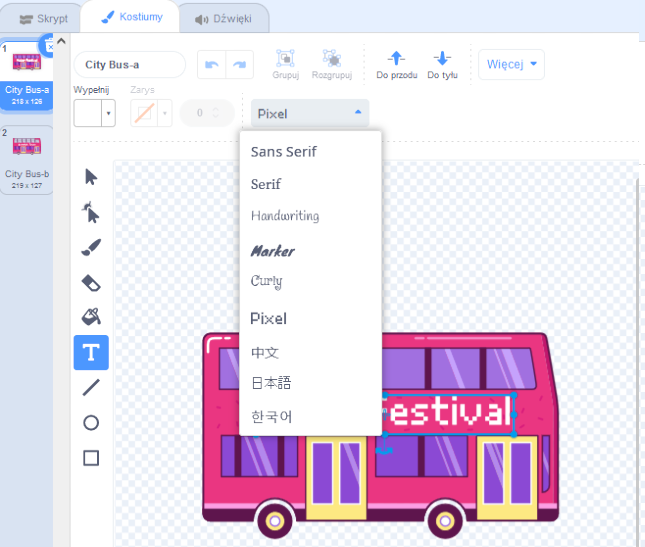
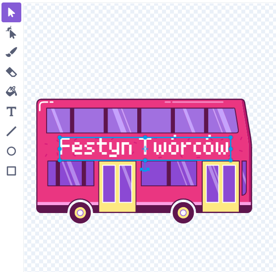

## Zmień miejsce docelowe

Napis na autobusie mówi "Maker Festival”, ale możesz zmienić cel podróży na wybrany przez siebie. Dokąd chcesz aby twój autobus pojechał?  

{:width="300px"}

--- task ---

Wybierz **Autobus** i kliknij zakładkę **Kostiumy**:

--- /task ---

--- task ---

Kliknij biały tekst "Scratch Tours”, aby go zaznaczyć, a następnie kliknij **Usuń** aby go usunąć.

--- /task ---

**Wskazówka:** Możesz użyć **Usuń** w edytorze Paint lub <kbd>Delete</kbd> na klawiaturze.

--- task ---

Wybierz narzędzie **Tekst** (pisanie).

Kliknij autobus, od którego ma się zaczynać Twój tekst, i wpisz wybrane przez siebie miejsce docelowe.

Aby zmienić czcionkę (styl pisania), możesz kliknąć menu rozwijane **Czcionka**:

--- /task ---

--- task ---

Kliknij narzędzie **Wybierz** (strzałka), a następnie przeciągnij tekst, aby umieścić go na autobusie.

--- /task ---

--- save ---
