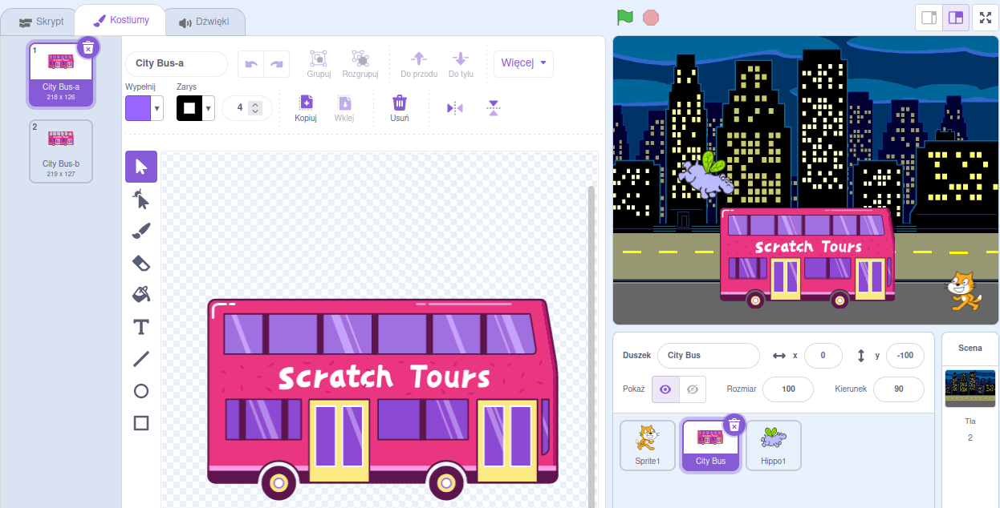

## Zmień miejsce docelowe

Na autobusie napisano „Scratch Tours” (ang. wycieczki po Scratchu), ale możesz zmienić cel podróży na wybrany przez siebie. Dokąd chcesz, aby Twój autobus pojechał?  

{:width="300px"}

### Edytuj duszka autobusu

--- task ---

Wybierz duszka **City Bus** i kliknij zakładkę **Kostiumy**:

--- /task ---

--- task ---

Kliknij biały tekst „Scratch Tours”, aby go zaznaczyć, a następnie kliknij **Usuń** aby go usunąć.

**Wskazówka:** Możesz użyć przycisku **Usuń** w edytorze Paint lub nacisnąć klawisz <kbd>Delete</kbd> na klawiaturze.

--- /task ---

--- task ---

Wybierz narzędzie **Tekst** (pisanie).

Kliknij autobus w miejscu, od którego ma się zaczynać się Twój tekst i wpisz wybrane przez siebie miejsce docelowe.

Aby zmienić czcionkę (styl pisania), możesz kliknąć rozwijane menu **Czcionka**:

--- /task ---

--- task ---

Kliknij narzędzie **Wybierz** (strzałka), a następnie przeciągnij tekst, aby umieścić go na autobusie.

--- /task ---

