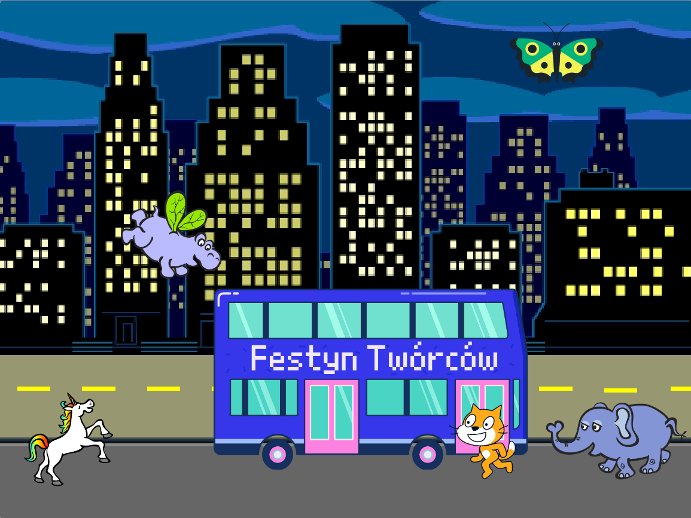

## Ulepsz swój projekt

Teraz możesz dodać wybranego duszka do swojej animacji. Będziesz musiał dodać kod, aby twój duszek `przeszedł do`{:class="block3motion"} pozycji startowej, `ustawił się`{:class="block3motion"} we właściwym kierunku, a następnie `powtórz`{:class ="block3control"} `przesuń`{:class="block3motion"} i `następny kostium`{:class="block3looks"} aby dotrzeć do autobusu.

**Wskazówka:** Kiedy klikasz **Wybierz Duszka**, możesz przytrzymać kursor myszy nad duszkiem, aby zobaczyć jego kostiumy, lub na niektórych urządzeniach mobilnych możesz dotknąć i przytrzymać duszka, aby zobaczyć jego kostiumy (jeśli okno wyskakuje po dotknięciu i przytrzymaniu duszka, dotknij boku ekranu, aby zamknąć okno i zobaczyć kostiumy). Przeszukiwanie kostiumów duszków może pomóc ci znaleźć duszka, który dobrze sprawdza się w animacji.

{:width="300px"}

Możesz użyć dowolnych bloków, których nauczyłeś się w tym projekcie, a także tych, które już znasz:

```blocks3
when flag clicked

when [timer v] > [5]

go to x: [0] y: [0] // drag the sprite to choose x and y

show

hide

glide [2] secs to x: [0] y: [-100] // bottom middle of the Stage

repeat [30]
end

point towards (City Bus v)

point in direction (180) // point down

set rotation style [left-right v]

move [3] steps

next costume

start sound [clown honk v]

wait [0.1] seconds // short delay

set [color v] effect to [50] // up to 200
```

--- collapse ---
---
title: Ukończony projekt
---

Tutaj możesz zobaczyć [ukończony projekt](https://scratch.mit.edu/projects/486719199/){:target="_blank"}.

--- /collapse ---

Możesz także „zremiksować” projekt, aby wprowadzić dowolne zmiany. Możesz dodać efekty dźwiękowe do autobusu lub innych duszków lub ustawić efekt kolorystyczny autobusu. Jeden z duszków mógł przegapić autobus i nie schować się.

Podziękowania dla projektantki cyfrowej Lyli za wysłanie tej fantastycznej aktualizacji!


--- save ---
