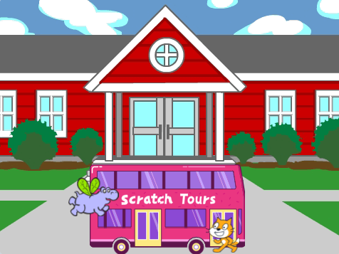

## O que você vai fazer

Neste projeto, você irá criar uma animação com atores que correm ou voam para alcançar um ônibus.

Você vai:
+ Fazer com que os atores façam coisas diferentes `quando a bandeira verde for clicada`{:class="block3events"}
+ Posicionar atores no **Palco**
+ Usar um loop do tipo `repeat` para `mover`{:class="block3motion"} e `alternar entre fantasias`{:class="block3looks"}

--- no-print --- --- task ---

### Jogar

  

Clique na bandeira verde para assistir a animação. 

Quais atores mudam suas fantasias para criar um efeito de animação?

  <iframe allowtransparency="true" width="485" height="402" src="https://scratch.mit.edu/projects/embed/724160134/?autostart=false" frameborder="0"></iframe>

--- /task --- --- /no-print ---

--- print-only ---

--- /print-only ---

** Animação ** cria o efeito de movimento por alternar entre as imagens rapidamente. Os primeiros animadores esculpiram quadros em blocos de madeira e os usavam como carimbos. É muito mais rápido usar o Scratch para escrever o código da sua animação!

