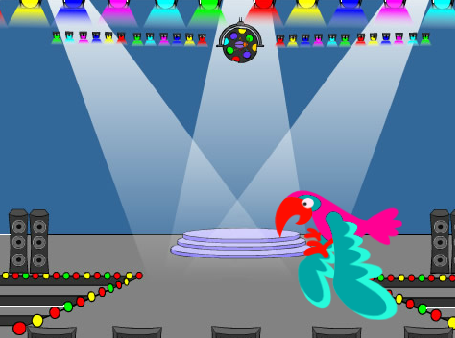

## E agora?

Se você estiver seguindo certo a [Introdução ao Scratch](https://projects.raspberrypi.org/pt-BR/pathways/scratch-intro), você pode passar para o projeto [Encontre o inseto](https://projects.raspberrypi.org/pt-BR/projects/find-the-bug). Neste projeto, você vai fazer um jogo no qual você terá que achar o inseto que está se escondendo em cada nível.

--- print-only ---

--- /print-only ---

--- no-print ---

  <iframe allowtransparency="true" width="485" height="402" src="https://scratch.mit.edu/projects/embed/606940456/?autostart=false" frameborder="0"></iframe>

--- /no-print ---

Se você quiser se divertir mais explorando os Scratch, então você pode tentar qualquer um [destes projetos](https://projects.raspberrypi.org/pt-BR/projects?software%5B%5D=scratch&curriculum%5B%5D=%201).

***
Este projeto foi traduzido por voluntários:

Armando Rocha
Flavio Silva

Graças a voluntários, podemos dar às pessoas de todo o mundo a chance de aprender em seu próprio idioma. Você pode nos ajudar a alcançar mais pessoas oferecendo-se para traduzir - mais informações em rpf.io/translate.
