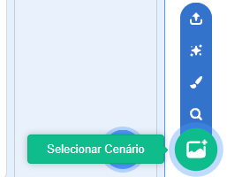
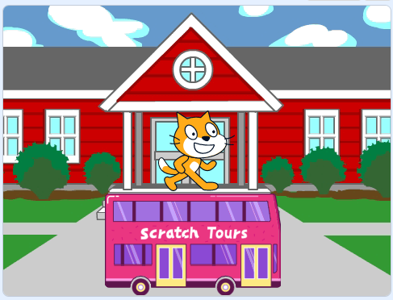
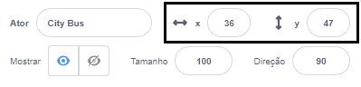
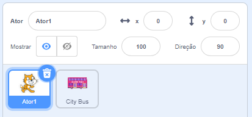

## Crie o cenário do teu ônibus

<div style="display: flex; flex-wrap: wrap">
<div style="flex-basis: 200px; flex-grow: 1; margin-right: 15px;">
Você vai escolher um cenário e adicionar um ator de ônibus.
</div>
<div>

![O ônibus de cidade com pano de fundo na escola.] (Images/bus-scene.png) {:width="300px"}

</div>
</div>

### Abra o projeto inicial

--- task ---

Abra o [projeto inicial Pegue o ônibus](https://scratch.mit.edu/projects/582214330/editor){:target="_ blank"}. O Scratch será aberto em outra aba do navegador.

[[[working-offline]]]

--- /task ---

### Escolha um Pano de Fundo

--- task ---

Clique (ou se você estiver em um tablet, toque) no **Escolha um Cenário** no painel Palco (no canto inferior direito da tela):



--- /task ---

--- task ---

Clique na categoria **Outdoors**. Adicione um cenário que seja um bom ponto de partida para o ônibus:


--- /task ---

### Escolha um Ator

--- task ---

Clique em **Escolher um Ator**:


--- /task ---

--- task ---

Digite `ônibus` na caixa de pesquisa no top da página:


Adicione o **Ônibus de Cidade** ao seu projeto.

--- /task ---

### Quando você arrasta o ônibus, ele vai na frente do Gato Scratch.

--- task ---

Verifique se o **Ônibus de Cidade** esteja selecionado na lista de Atores abaixo do Palco.

`Quando a bandeira verde for clicada`{:class="block3events"}, arraste um bloco de `Eventos`{:class="block3events"} para a área de código:


```blocks3
when flag clicked
```

--- /task ---

--- task ---

Arraste o ônibus para uma boa posição no Palco:



As coordenadas **x** e **y** (os números usados para descrever a posição) do ônibus são mostradas no painel Ator abaixo do Palco:



--- /task ---

--- task ---

Adicione um bloco `vá para x: y:`{:class="block3motion"}:


```blocks3
when flag clicked
+go to x: (0) y: (-100)
```

Os números no bloco `vá para x: y:`{:class="block3motion"} são as coordenadas atuais x e y do ônibus. Os números no seu projeto podem ser um pouco diferentes.

--- /task ---

--- task ---

**Teste:** Arraste o ônibus para qualquer lugar do Palco e clique na bandeira verde. O ônibus deve parar na sua posição inicial.


--- /task ---

### Mova o ônibus atrás dos atores

--- task ---

Para ter certeza de que o ator **Ônibus Cidade** está sempre por trás de todos os outros atores, adicione um bloco `ir para a primeira camada`{:class="block3looks"}, em seguida, clique em `frente`{:class="block3looks"} e altere-o para `costas`{:class="block3looks"}:


```blocks3
when flag clicked
go to x: (0) y: (-100)
+ go to [back v] layer
```

**Dica:** Se você não conseguir ver o bloco `ir para a primeira camada`{:class="block3looks"}, você precisa rolar para baixo no menu de blocos `Aparência`{:class="block3looks"}.

--- /task ---

### No momento, o Gato Scratch é grande demais para caber no ônibus.

--- task ---

Você pode mudar a cor do ônibus:


```blocks3
when flag clicked
go to x: (0) y: (-100)
go to [back v] layer
+set [color v] effect to (50) // try numbers up to 200
```

--- /task ---

### Redimensione o Gato Scratch

--- task ---

O Gato Scratch aparece em todos os novos projetos Scratch como **Ator1** na lista Sprite. Clique no ator **Ator1** na lista de Atores para começar a animação do Gato Scratch:



**Dica:** Se você acidentalmente excluiu o ator **Ator1** (Gato Scratch), você pode clicar no ícone **Selecione um Ator** e procurar por `cat`.

--- /task ---

--- task ---

No painel Ator, clique na propriedade **Tamanho** e altere o tamanho do Gato Scratch para `50`:


--- /task --- 
