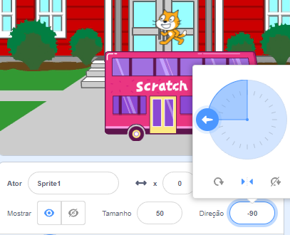
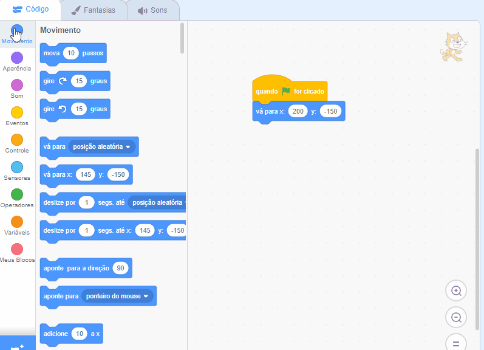

## O Gato Scratch alcança o ônibus

<div style="display: flex; flex-wrap: wrap">
<div style="flex-basis: 200px; flex-grow: 1; margin-right: 15px;">
Você fará uma animação do Gato Scratch que vai aparecer no **lado direito** do Palco e depois vai caminhar até o ônibus fazendo o mesmo movimento várias vezes em um **loop**. 
</div>
<div>

![O Gato Scratch caminhando em direção ao ônibus.] (Images/cat-catches-bus.png) {: width = "300px"}

</div>
</div>

### Ponha o Gato Scratch em sua posição inicial

--- task ---

Clique na propriedade **Direção** no painel Ator. Gire a seta até ela apontar o `-90`. Em seguida, clique no meio do ícone **Esquerda / Direita** para alterar o estilo de rotação para `esquerda ou direita` para impedir que o Gato Cat vire de cabeça para baixo:



--- /task ---

--- task ---

Arraste o Gato Scratch para o lado superior direito do Palco.


**Dica:** Se você tentar posicionar um sprite fora do Palco, ele voltará para sua última posição no Palco.

--- /task ---

--- task ---

Adicione o código para fazer o Gato Scratch ir para sua posição inicial:


```blocks3
when flag clicked
go to x:(200) y:(-150) // bottom right-hand side
```

--- /task ---

--- task ---

**Teste:** Arraste o Gato Scratch para uma nova posição e, em seguida, clique no seu bloco `vá para x: y:`{:class="block3motion"}. O Gato Scratch deve voltar para o lado direito inferior a cada vez.

--- /task ---

### Fazendo a animação

Você vai adicionar o código em um bloco de loop `repita`{:class="block3control"} para fazer o Gato Scratch repetir um pequeno número de passos diversas vezes. Isso fará com que o Gato Scratch pareça estar se movimentando.

--- task ---

Adicione um bloco `repita`{:class="block3control"} `10` e depois arraste um bloco `mova`{:class="block3motion"} de `10` `passos`{:class="block3motion"} para dentro dele:




```blocks3
when flag clicked
go to x:(200) y:(-150) // bottom right-hand side
+ repeat (10) // try different numbers
move (5) steps //  5 is a good walking speed
end
```

--- /task ---

--- task ---

**Teste:** Clique na bandeira verde. Tente mudar os números para que o Gato Scratch pare exatamente no ônibus.

--- /task ---

Alguns atores têm mais de uma fantasia. Você vai usar as fantasias do **Gato Scratch** para criar uma animação com o Gato Scratch caminhando.

--- task ---

Clique no ícone **Fantasias**. O **Gato Scratch** tem duas fantasias e, juntos, elas podem ser usadas para simular um movimento de caminhada.

--- /task ---

--- task ---

Clique na guia **Código**. Adicione um bloco `próxima fantasia`{:class="block3looks"}:


```blocks3
when flag clicked
go to x:(200) y:(-150) // bottom right-hand side
repeat (20) // try different numbers
move (5) steps //  5 is a good walking speed
+ next costume 
end
```
--- /task ---

--- task ---

**Teste:** Clique na bandeira verde e o Gato Scratch vai caminhar em direção ao ônibus.

--- /task ---

### Esconda o Gato Scratch

--- task ---

Adicione um bloco `ocultar`{: class = "block3looks"} o Gato Scratch quando todos os atores chegarem ao ônibus:


```blocks3
when flag clicked
go to x:(200) y:(-150) // bottom right-hand side
repeat (20) // try different numbers
move (5) steps //  5 is a good walking speed
next costume 
end
+ hide
```

--- /task ---

--- task ---

**Teste:** Clique na bandeira verde novamente e você verá que o Gato Scratch desapareceu.

--- /task ---

### Mostre o Gato Scratch

--- task ---

Adicione um bloco `mostre`{:class="block3looks"} para que o Gato Scratch apareça antes que eles caminhem para o ônibus:


```blocks3
when flag clicked
go to x:(200) y:(-150) // bottom right-hand side
+ show
repeat (20) // try different numbers
move (5) steps //  5 is a good walking speed
next costume 
end
hide
```

**Dica:** Quando você usa um bloco `esconda`{:class="block3looks"}, você também precisa adicionar um bloco `mostre`{:class="block3looks"} para garantir que um ator esteja visível quando for preciso.

--- /task ---

--- task ---

**Teste:** Clique na bandeira verde para testar seu projeto e certifique-se de que o Gato Scratch apareça.

--- /task ---

