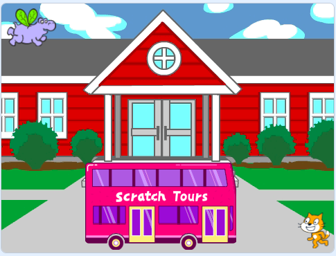

## O hipopótamo alcança o ônibus voando

<div style="display: flex; flex-wrap: wrap">
<div style="flex-basis: 200px; flex-grow: 1; margin-right: 15px;">
Você vai adicionar um ator hipopótamo que voa até o ônibus.
</div>
<div>

{:width="300px"}

</div>
</div>

### Dê ao hipopótamo uma posição inicial

--- task ---

Mude o **Tamanho** do ator **Hippo1**:

Adicione o ator **Hippo1** ao seu projeto.


--- /task ---

--- task ---

Arraste o hipopótamo para o lado esquerdo superior do Palco.



--- /task ---

--- task ---

Adicione o código para fazer o hipopótamo voltar à posição inicial:

```blocks3
when flag clicked
go to x: [-200] y: [150] // lado esquerdo superior
```

**Dica:** As coordenadas `x`{:class="block3motion"} e `y`{:class="block3motion"} no bloco `vá para x: y:`{:class="block3motion"} vão ser a posição atual do hipopótamo, assim você não precisa digitar elas.

--- /task ---

### Faça o hipopótamo bater as asas e voar

--- task ---

Adicione código para fazer a hipopótamo voar até o **Ônibus Cidade**:

```blocks3
when flag clicked
go to x: [-200] y: [150] 
+repeat [100] 
point towards (City Bus v) // mudar com o ponteiro do mouse
move [3] steps
next costume
+end
```

--- /task ---

--- task ---

**Teste:** Clique na bandeira verde e veja se o hipopótamo voa em direção ao ônibus. Você pode alterar o número que está no bloco `repita`{:class="block3control"} para fazer o hipopótamo parar no lugar certo.

--- /task ---

### Mostre e esconda o ônibus

--- task ---

Adicione os blocos `mostre`{:class="block3looks"} e `esconda`{:class="block3looks"}:

```blocks3
when flag clicked
go to x: [-200] y: [150] 
+ show
repeat [90] 
point towards (City Bus v)
move [3] steps
next costume
end
+ hide
```

--- /task ---

--- task ---

**Teste:** Clique na bandeira verde. O hipopótamo vai voar e entrar no ônibus.

--- /task ---
