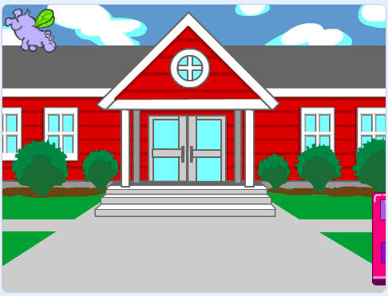

## O ônibus parte

<div style="display: flex; flex-wrap: wrap">
<div style="flex-basis: 200px; flex-grow: 1; margin-right: 15px;">
Adicione mais blocos para fazer o ônibus partir.
</div>
<div>

 {:width="300px"}

</div>
</div>

### Anime o ônibus

--- task ---

Selecione o ator **Ônibus Cidade**.


--- /task ---

--- task ---

O ônibus vai sair para a direita quatro segundos depois que a bandeira verde for clicada.


```blocks3
when flag clicked 
wait [4] seconds // change 1 to 4
```

--- /task ---

--- task ---

Arraste seu ônibus para o lado direito do Palco. Este será a `x`{:class="block3motion"} e `y`{:class="block3motion"} posição para qual o ônibus `irá`{:class="block3motion"}.



**Dica:** Se você mover o ônibus demais para a direita, ele irá para trás. Tente novamente, mas não o coloque tão longe.

--- /task ---

--- task ---

when [timer v] &gt; [4] // mude de 10 para 4

As coordenadas `x`{:class="block3motion"} e `y`{:class="block3motion"} no seu projeto podem ser um pouco diferentes.


```blocks3
when [timer v] > [4] 
+glide [2] secs to x: [320] y: [-100] // lado direito do palco
```

--- /task ---

--- task ---

**Teste:** Clique na bandeira verde. O Gato Scratch e o hipopótamo irão se mover em direção ao ônibus, e o ônibus irá se mover para a direita depois de quatro segundos.

--- /task ---

### Esconda e mostre o Ônibus

--- task ---

Adicione um bloco `esconda`{:class="block3looks"} para fazer com que o ônibus pareça sair do palco:


```blocks3
when [timer v] > [4] 
glide [2] secs to x: [320] y: [-100]
+ hide
```
--- /task ---

--- task ---

**Teste:** Clique na bandeira verde. O ônibus agora vai se esconder após a partida. Você se lembra de como assegurar que um sprite reapareça quando você clicar na bandeira verde?

--- /task ---

--- task ---

Adicione um bloco `mostre`{:class="block3looks"} ao seu script `Quando a bandeira verde for clicada`{:class="block3events"} para fazer o ônibus aparecer quando você executar o script:


```blocks3
when flag clicked
go to x: (0) y: (-100)
go to [back v] layer
set [color v] effect to (85) // tente números até 200
+show
```

--- /task ---

--- task ---

**Teste:** Clique na bandeira verde e assista à animação. O ônibus deve aparecer no centro do Palco, ir para a direita e então desaparecer.

Está todo mundo no ônibus quando ele parte? Você pode alterar a quantidade de tempo que o ônibus espera, se necessário.

--- /task ---
