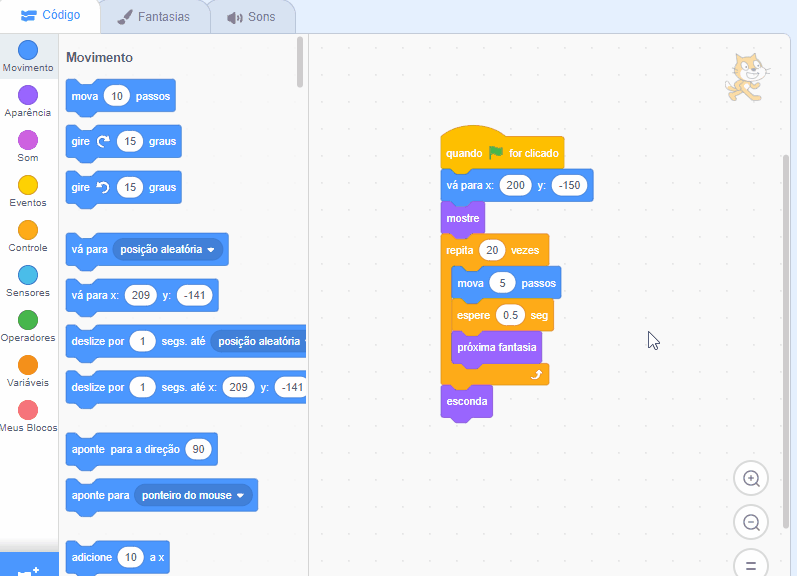

## Perdendo o ônibus

<div style="display: flex; flex-wrap: wrap">
<div style="flex-basis: 200px; flex-grow: 1; margin-right: 15px;">
E se o Gato Scratch não for rápido o suficiente para pegar o ônibus?
</div>
<div>

{:width="300px"}

</div>
</div>

### Faça o Gato Scratch perder o ônibus

--- task ---

Selecione o **Gato Scratch** e adicione um bloco `aguarde`{:class="block3control"}:


```blocks3
when flag clicked
go to x:(200) y:(-150) 
show
repeat (20) // try different numbers
move (5) steps 
next costume 
+ wait (1) seconds
end
hide
```
--- /task ---

--- task ---

**Teste:** Clique na bandeira verde. O Gato Scratch vai andar muito devagar e vai perder o ônibus!

--- /task ---

### Faça o Gato Scratch pegar o ônibus

--- task ---

Você vai querer ter um atraso de menos de um segundo. 0,5 é meio segundo, 0,25 é um quarto de segundo e 0,1 é um décimo de segundo.

Altere o atraso no bloco `aguarde`{:class="block3control"}:


```blocks3
wait (0.2) seconds // try 0.1, 0.5, 0.05
```

**Teste:** Clique na bandeira verde e o Gato Scratch vai andar mais rápido. Escolha o tempo de atraso que você quiser.

--- /task ---

### Escolha se Gato Scratch pega ou perde o ônibus

--- task ---

Se você quiser que o Gato Scratch **perca o ônibus**, remova o bloco `esconda`{:class="block3looks"} do código, assim o Gato Scratch vai permanecer no Palco:




```blocks3
when flag clicked
go to x:(200) y:(-150) 
show
repeat (20) 
move (5) steps 
next costume
wait (0.5) seconds 
end
-hide
```
--- /task ---

--- task ---

Se você quiser que o Gato Scratch **pegue o ônibus**, faça o ônibus esperar um pouco mais antes de partir:


```blocks3
+when [timer v] > [6] // mudar de 4 para 6
glide [2] secs to x: [320] y: [-100] // lado direito do palco
hide
```

Você vai precisar colocar o bloco `esconda`{:class="block3looks"} de volta no ator do código do **Gato Scratch** se você o tiver removido e quiser que o Gato Scratch alcance o ônibus com sucesso.

--- /task ---

--- task ---

Faça alterações até que você consiga que a animação funcione do jeito que você quer.

--- /task ---

<p style="border-left: solid; border-width:10px; border-color: #0faeb0; background-color: aliceblue; padding: 10px;">
Quando você estiver em um projeto, frequentemente você vai voltar a seu código e alterá-lo conforme você tem ideias novas. 
</p>


