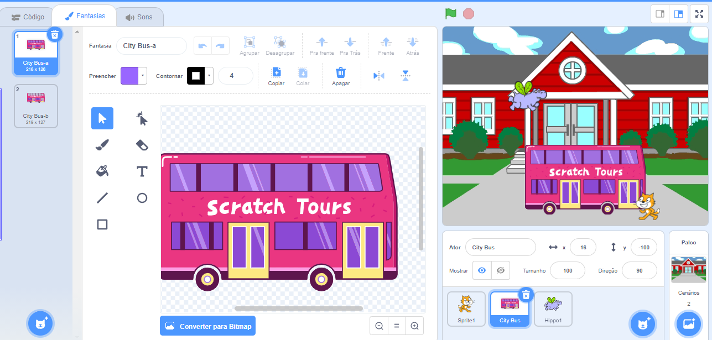
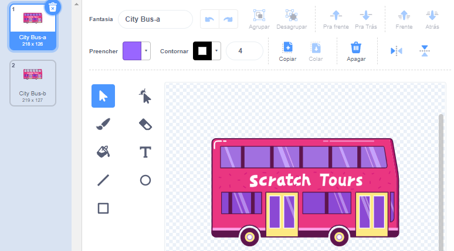
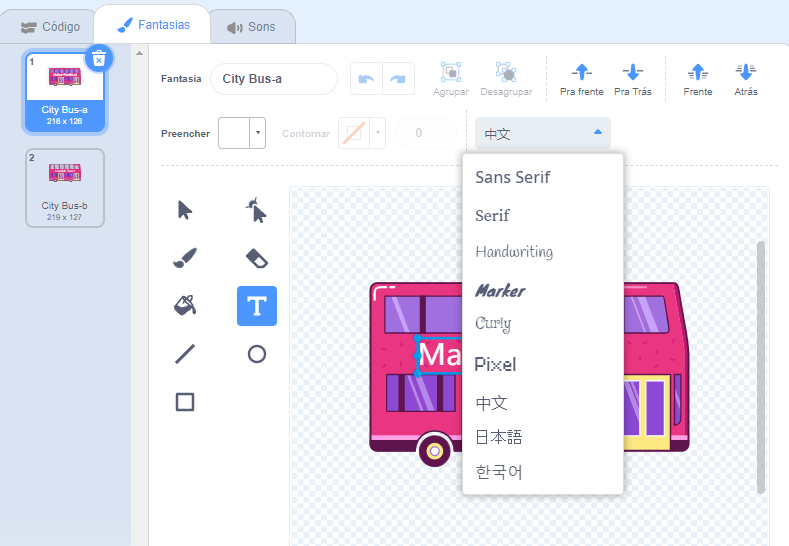
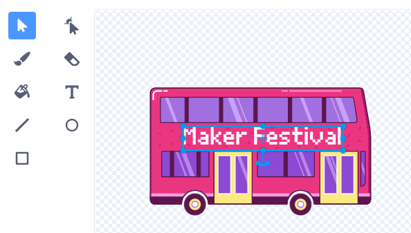

## Mudando o destino

O texto no ônibus diz "Excursão Scratch", mas você pode mudar o destino para onde você quiser. Para onde você quer que o ônibus vá?  

{:width="300px"}

### Edit the City Bus sprite

--- task ---

Selecione o **Ônibus da Cidade** e clique na aba**Fantasias**:

--- /task ---

--- task ---

Clique no texto branco "Excursão Scratch" para selecioná-lo, e depois em **Deletar** para removê-lo.

**Tip:** You can use the **Delete** icon in the Paint editor or the <kbd>Delete</kbd> key on your keyboard.

--- /task ---

--- task ---

Selecione a ferramenta( de escrita) **Texto**.

Clique no ônibus onde você quer que o texto comece e digite o que você quiser.

Para mudar a fonte (estilo de escrita), você pode clicar no menu**Fonte**:

--- /task ---

--- task ---

Clique na ferramenta **Selecionar**(Seta), e arraste o texto para colocá-lo no ônibus.

--- /task ---

