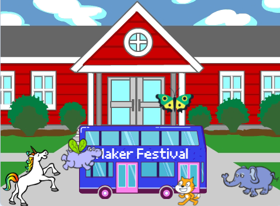

## Melhore o seu projeto

Agora, você pode adicionar um ator de sua escolha à sua animação. Você terá que adicionar código para fazer com que seu sprite `vá para`{:class="block3motion"} a posição inicial, `aponte`{:class="block3motion"} para a direção correta, e então `repetir`{:class="block3control"} os blocos `mova`{:class="block3motion"} e `próxima fantasia`{:class="block3looks"} para alcançar o ônibus.

**Dica:** Quando você clicar em **Selecione um Ator**, você segurar o cursor sobre o ator para ver suas fantasias, ou em alguns dispositivos móveis, você pode tocar e segurar sobre um sprite para ver suas fantasias (se uma janela aparecer quando você tocar e segurar no ator, toque na lateral da tela para fechar a janela e ver as fantasias). Olhar as fantasias dos atores pode te ajudar a decidir qual deles vai funcionar melhor na animação.

{:width="300px"}

Você pode usar qualquer um dos blocos que você já aprendeu neste projeto, bem como aqueles que você já tem conhecimento:

```blocks3
when flag clicked

go to x: [0] y: [0] // arraste o sprite para escolher x e y

show

hide

glide [2] secs to x: [0] y: [-100] // meio inferior do palco

repeat [30]
end

point towards (City Bus v)

point in direction (180) // apontar para baixo

set rotation style [left-right v]

move [3] steps

next costume

start sound [clown honk v]

wait [0.1] seconds // pequeno curto

set [color v] effect to [50] // até 200
```

--- collapse ---
---
title: A conclusão do projeto
---

Você pode ver o [projeto completo aqui](https://scratch.mit.edu/projects/607395913/){:target="_blank"}.

--- /collapse ---

Você também pode brincar com o projeto e fazer quaisquer mudanças que você quiser. Você pode colocar efeitos sonoros no ônibus, em outros atores, ou mudar os efeitos de cor do ônibus. Um dos atores pode perder o ônibus e não ficar oculto.

Obrigado à criadora digital Lyla por enviar esta atualização incrível!


--- save ---
