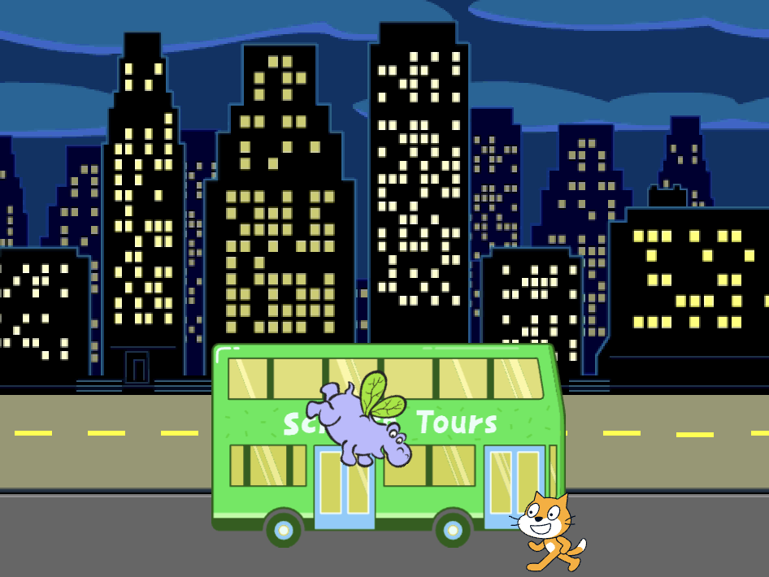

## Du kommer skapa

Skapa en animering med sprajter som springer eller flyger för att hinna med bussen 🚌.

Du kommer:
+ Få sprajter att göra olika saker `när den gröna flaggan klickas på`{:class="block3events"}
+ Placera sprajter på **scenen**
+ Använd en `repetera`{:class="block3control"}loop för att få sprajter att `röra`{:class="block3motion"}sig och `byta klädsel`{:class="block3looks"}

--- no-print ---

--- task ---

### Spela ▶️

  

Klicka på den gröna flaggan för att se animeringen. 

Vilka sprajter byter ut sina klädslar för att skapa en 🎥 animeringsseffekt?

  <iframe allowtransparency="true" width="485" height="402" src="https://scratch.mit.edu/projects/embed/724160134/?autostart=false" frameborder="0"></iframe>

--- /task ---

--- /no-print ---

--- print-only ---

--- /print-only ---

**Animering** kan se ut som rörelse genom att byta bilder snabbt. De första animatörerna ristade bilder i träblock och använde dem som frimärken. Det går mycket snabbare att använda Scratch för att koda din animation!

