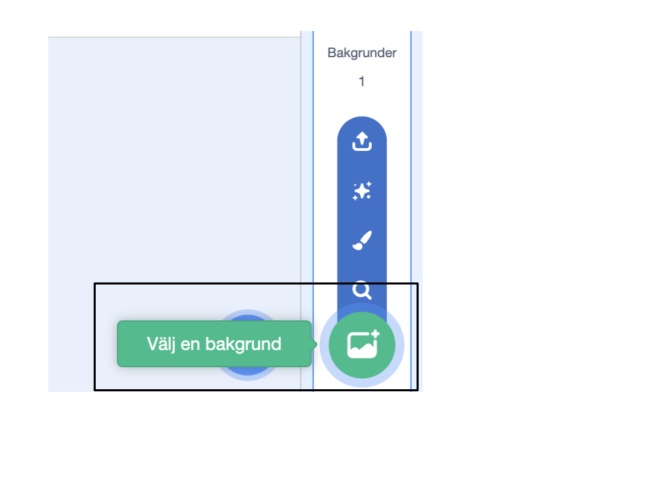
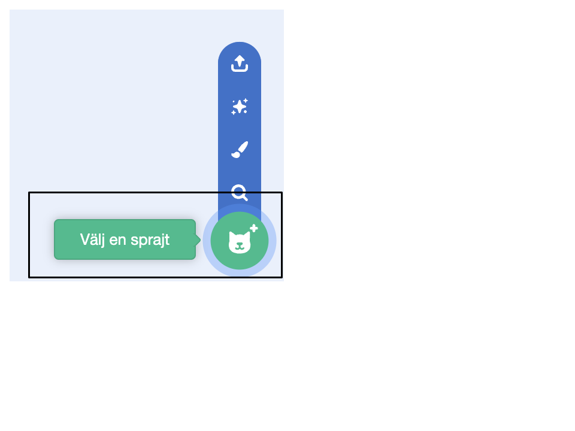
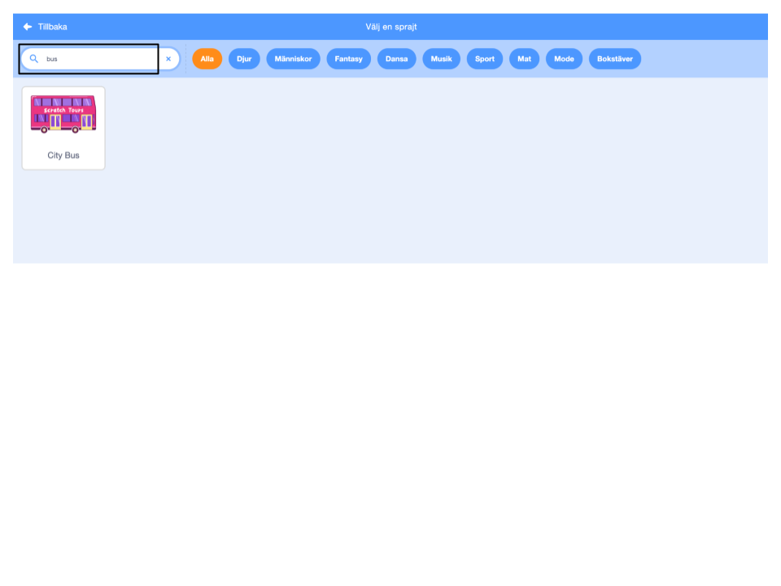
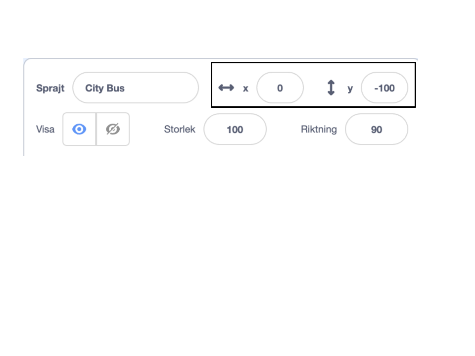
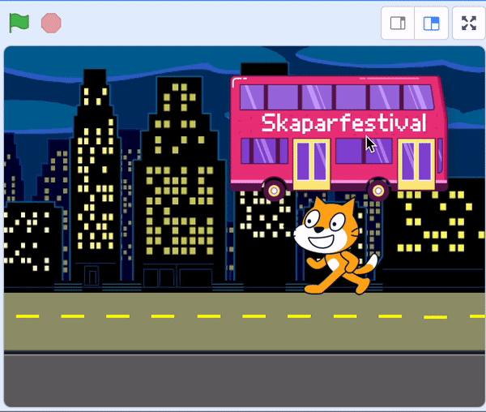
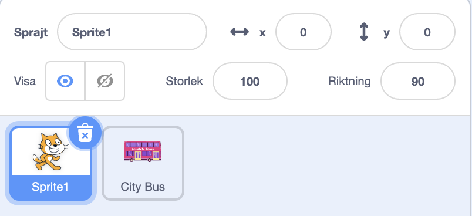
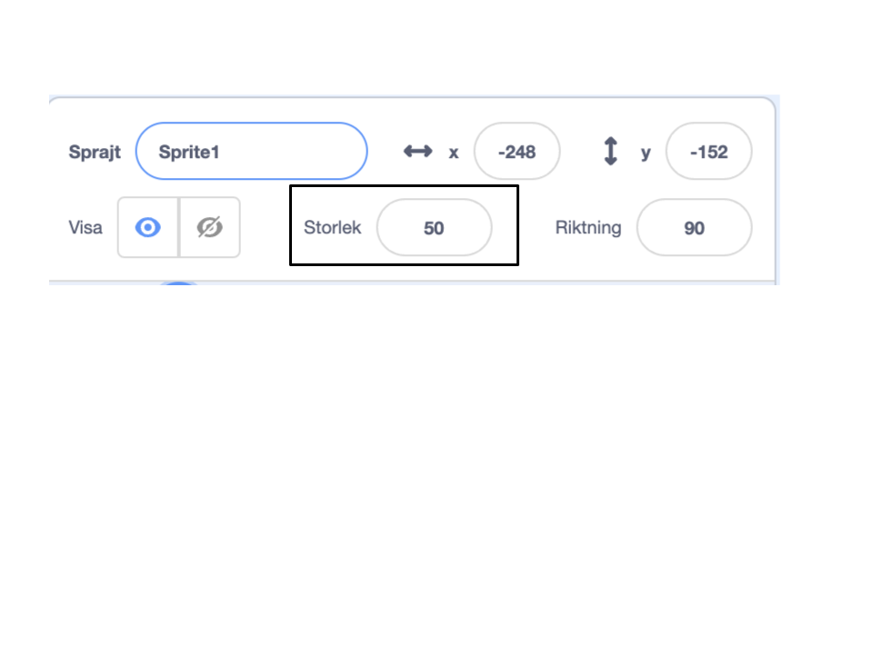

## Skapa din bussscen

<div style="display: flex; flex-wrap: wrap">
<div style="flex-basis: 200px; flex-grow: 1; margin-right: 15px;">
Välj en bakgrund och lägg till en bussprajt.
</div>
<div>

{:width="300px"}

</div>
</div>

### Öppna startprojektet

--- task ---

Öppna [Hinn med bussen startprojektet](https://scratch.mit.edu/projects/582214330/editor){:target="_blank"}. Scratch kommer öppnas i en annan flik i webbläsaren.

[[[working-offline]]]

--- /task ---

### Välj en bakgrund

--- task ---

Klicka (eller på en surfplatta, tryck) på **Välj en bakgrund** i scenfönstret (i det nedre högra hörnet av skärmen):



--- /task ---

--- task ---

Klicka på **Utomhus**kategorin. Lägg till en bakgrund som är en bra startpunkt för din buss:


--- /task ---

### Välj en sprajt

--- task ---

Klicka på **Välj en Sprajt**:



--- /task ---

--- task ---

Skriv `bus` i sökfältet högst upp:



Lägg till sprajten **stadsbuss** i ditt projekt.

--- /task ---

### Välj en startposition för din buss

--- task ---

Se till att **stadsbuss**-sprajten är vald i sprajtlistan under scenen.

Dra ett `när den gröna flaggan klickas på`{:class="block3events"}-block från menyn `händelser`{:class="block3events"}block till kodområdet:


```blocks3
when flag clicked
```

--- /task ---

--- task ---

Dra bussen till en bra position på scenen:


**X**- och **y**-koordinaterna (siffrorna som används för att beskriva positionen) för bussen visas i sprajtrutan under scenen:



--- /task ---

--- task ---

Lägg till ett `gå till x: y:`{:class="block3motion"}-block:


```blocks3
when flag clicked
+go to x: (0) y: (-100)
```

Siffrorna i `gå till x: y:`{:class="block3motion"}-blocket är bussens nuvarande x- och y-koordinater. Siffrorna i ditt projekt kan vara lite annorlunda.

--- /task ---

--- task ---

**Test:** Dra bussen var som helst på scenen och klicka sedan på den gröna flaggan. Bussen ska alltid gå till sin startposition.



--- /task ---

### Flytta bussen bakom karaktärssprajterna

--- task ---

För att se till att **stadsbuss**sprajten alltid ligger bakom alla karaktärssprajter, lägg till ett `gå till översta lagret`{:class="block3looks"}block och klicka sedan på `översta`{:class="block3looks"} och ändra det till `tillbaka`{:class="block3looks"}:


```blocks3
when flag clicked
go to x: (0) y: (-100)
+ go to [back v] layer
```

**Tips:** Om du inte kan se blocket `gå till det översta lagret`{:class="block3looks"} måste du rulla ner i blockmenyn `utseende`{:class="block3looks"}.

--- /task ---

### Ändra bussens färg

--- task ---

Du kan ändra färgen på bussen:


```blocks3
when flag clicked
go to x: (0) y: (-100)
go to [back v] layer
+set [color v] effect to (50) // prova tal upp till 200
```

--- /task ---

### Ändra storlek på Scratchkatten

--- task ---

Scratchkatten visas i alla nya Scratch-projekt som **Sprajt1** i sprajtlistan. Klicka på **Sprajt1** i sprajtlistan för att animera Scratchkatten:



**Tips:** Om du av misstag har tagit bort **Sprajt1** (Scratchkatten) kan du klicka på ikonen **Välj en sprajt** och söka efter `cat`.

--- /task ---

--- task ---

I sprajtrutan klickar du på egenskapen **Storlek** och ändrar Scratchkattens storlek till `50`:



--- /task --- 
