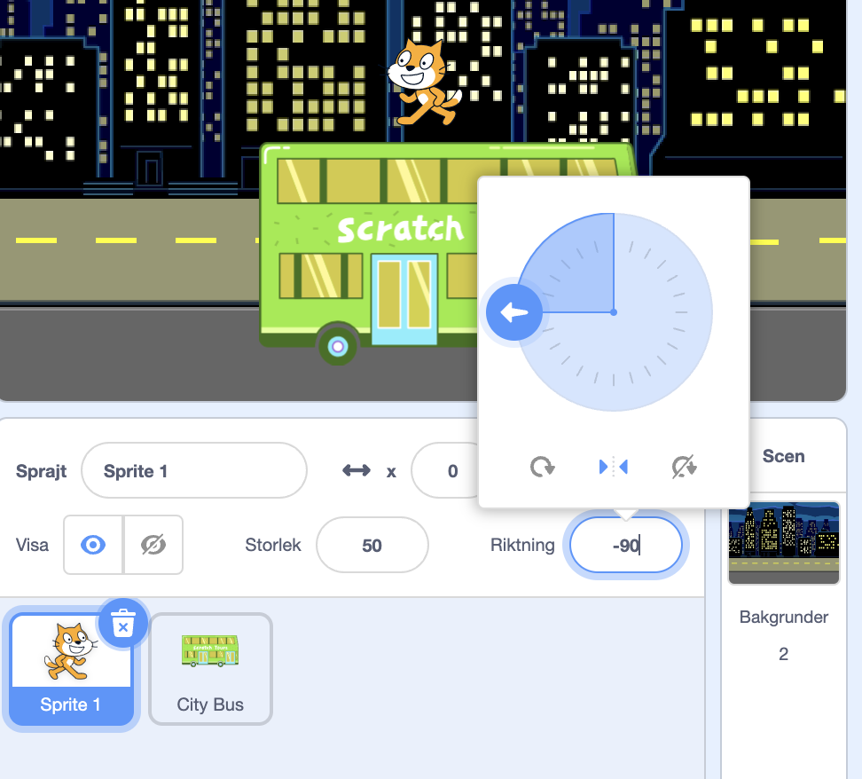
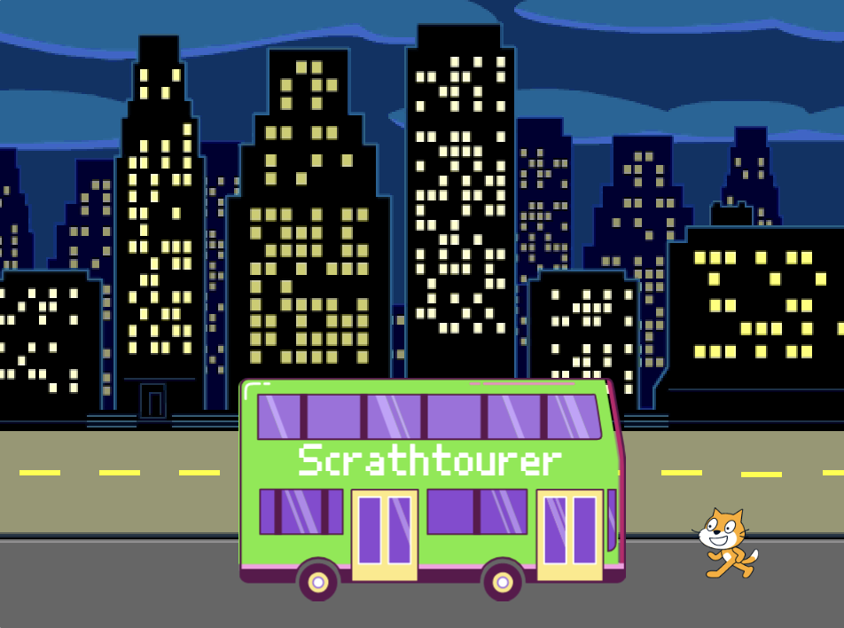
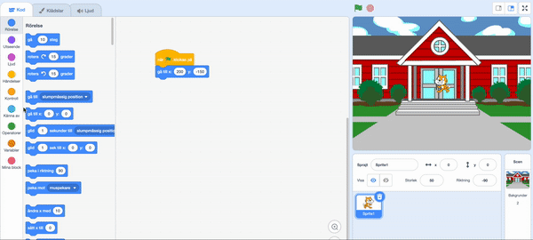

## Scratchkatten hinner med bussen

<div style="display: flex; flex-wrap: wrap">
<div style="flex-basis: 200px; flex-grow: 1; margin-right: 15px;">
Animera Scratchkatten så att den dyker upp på **höger sida** av scenen och går till bussen genom att upprepa en liten rörelse många gånger i en **loop**. 
</div>
<div>

{:width="300px"}

</div>
</div>

### Ställ Scratchkatten till sin startposition

--- task ---

Klicka på **riktnings**egenskapen i sprajtrutan. Vrid pilen så att den pekar på `-90`. Klicka sedan på **Vänster/Höger**ikonen i mitten för att ändra rotationsstilen till `vänster-höger` för att förhindra att Scratchkatten från att vända sig upp och ner:



--- /task ---

--- task ---

Dra Scratchkatten till den nedre högra sidan av scenen.



**Tips:** Om du försöker placera en spajt utanför scenen kommer den att flyttas tillbaka till sin senaste position på scenen.

--- /task ---

--- task ---

Lägg till kod för att få Scratchkatten till sin startposition:


```blocks3
when flag clicked
go to x:(200) y:(-150) // bottom right-hand side
```

--- /task ---

--- task ---

**Test:** Dra Scratchkatten till en ny position och klicka sedan på ditt `gå till x: y:`{:class="block3motion"}-block. Scratchkatten bör flytta sig tillbaka till det nedre högra hörnet varje gång.

--- /task ---

### Animera Scratchkatten

Du kommer att lägga till kod i en `repetera`{:class="block3control"}loop för att få Scratchkatten att upprepa ett litet antal steg många gånger. Detta kommer att få Scratchkatten att verka animerad.

--- task ---

Lägg till ett `repetera`{:class="block3control"} `10`-block och dra sedan ett `-röra sig`{:class="block3motion"} `10` `steg`{:class="block3motion"}-block inuti det:




```blocks3
when flag clicked
go to x:(200) y:(-150) // bottom right-hand side
+ repeat (10) // try different numbers
move (5) steps //  5 is a good walking speed
end
```

--- /task ---

--- task ---

**Test:** Klicka på den gröna flaggan. Prova att ändra talen i `repetera`{:class="block3control"} `10`-blocket så att Scratchkatten stannar vid bussen.

--- /task ---

Vissa sprajter har mer än en klädsel. Du kommer att använda **Scratchkatt**sprajtens klädslar för att skapa en animering av Scratchkatten som går.

--- task ---

Klicka på fliken **klädslar**. **Scratchkatt**sprajten har två klädslar och tillsammans kan de användas för få katten att gå.

--- /task ---

--- task ---

Klicka på **Kod**fliken. Add a `next costume`{:class="block3looks"} block inside the `repeat`{:class="block3control"} block:


```blocks3
when flag clicked
go to x:(200) y:(-150) // bottom right-hand side
repeat (20) // try different numbers
move (5) steps //  5 is a good walking speed
+ next costume 
end
```
--- /task ---

--- task ---

**Test:** Klicka på den gröna flaggan så går Scratchkatten till bussen.

--- /task ---

### Dölj Scratchkatten

--- task ---

Lägg till ett `dölj`{:class="block3looks"}block till Scratchkatten när de når bussen:


```blocks3
when flag clicked
go to x:(200) y:(-150) // bottom right-hand side
repeat (20) // try different numbers
move (5) steps //  5 is a good walking speed
next costume 
end
+ hide
```

--- /task ---

--- task ---

**Test:** Klicka på den gröna flaggan igen så ser du att Scratchkatten nu har försvunnit.

--- /task ---

### Visa Scratchkatten

--- task ---

Lägg till ett `visa`{:class="block3looks"}block så att Scratchkatten är synlig innan den går till bussen:


```blocks3
when flag clicked
go to x:(200) y:(-150) // bottom right-hand side
+ show
repeat (20) // try different numbers
move (5) steps //  5 is a good walking speed
next costume 
end
hide
```

**Tips:** När du använder ett `dölj`{:class="block3looks"}-block måste du även lägga till ett `visa`{:class="block3looks"}-block för att se till att en sprajt är synlig när den ska vara det.

--- /task ---

--- task ---

**Test:** Klicka på den gröna flaggan för att testa ditt projekt och se till att Scratchkatten visas.

--- /task ---

