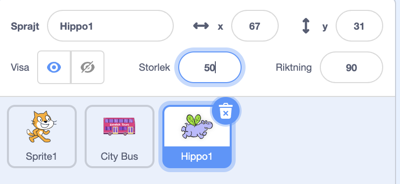

## Flodhästen flyger till bussen

<div style="display: flex; flex-wrap: wrap">
<div style="flex-basis: 200px; flex-grow: 1; margin-right: 15px;">
Lägg till en flodhästsprajt som flyger till bussen.
</div>
<div>

{:width="300px"}

</div>
</div>

### Ge flodhästen en startposition

--- task ---

Lägg till **Hippo1**-sprajten till ditt projekt.

Ändra **storlek** på **Hippo1** sprajten:



--- /task ---

--- task ---

Dra flodhästen till det övre vänstra hörnet på scenen.


--- /task ---

--- task ---

Lägg till kod för att få flodhästen till sin startposition:

```blocks3
when flag clicked
go to x: [-200] y: [150] // top left-hand side
```

**Tips:** `x`{:class="block3motion"} och `y`{:class="block3motion"}-koordinaterna i `gå till x: y:`{:class="block3motion"}-blocket kommer att vara flodhästens nuvarande position, så du behöver inte skriva in dem.

--- /task ---

### Få flodhästen att flaxa med vingarna och flyga

--- task ---

Lägg till kod som får flodhästen att flyga mot **stadsbussen**:

```blocks3
when flag clicked
go to x: [-200] y: [150] 
+repeat [100] 
point towards (City Bus v) // change from mouse-pointer
move [3] steps
next costume
+end
```

--- /task ---

--- task ---

**Test:** Klicka på den gröna flaggan och kontrollera att flodhästen flyger till bussen. Du kan ändra talet i `repetera`{:class="block3control"}-blocket för att få flodhästen att stanna på precis rätt ställe.

--- /task ---

### Visa och dölj bussen

--- task ---

Lägg till `visa`{:class="block3looks"}- och `dölj`{:class="block3looks"}block:

```blocks3
when flag clicked
go to x: [-200] y: [150] 
+ show
repeat [90] 
point towards (City Bus v)
move [3] steps
next costume
end
+ hide
```

--- /task ---

--- task ---

**Test:** Klicka på den gröna flaggan. Flodhästen kommer att flyga och gå på bussen.

--- /task ---
