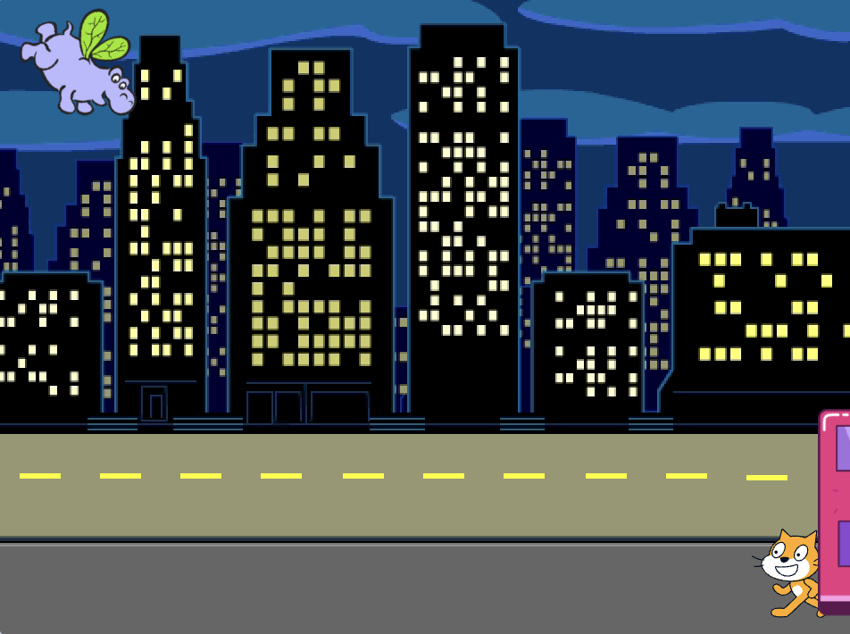

## Bussen går

<div style="display: flex; flex-wrap: wrap">
<div style="flex-basis: 200px; flex-grow: 1; margin-right: 15px;">
Lägg till fler block som får bussen att köra iväg.
</div>
<div>

{:width="300px"}

</div>
</div>

### Animera bussen

--- task ---

Välj **Stadsbuss**-sprajten.


--- /task ---

--- task ---

Lägg till kod som får bussen att köra iväg till höger fyra sekunder efter den gröna flaggan har klickats.


```blocks3
when flag clicked 
wait [4] seconds // change 1 to 4
```

--- /task ---

--- task ---

Dra din buss till höger sida av scenen. Detta är `x`{:class="block3motion"}- och `y`{:class="block3motion"}positionen som bussen `glider`{:class="block3motion"} till.



**Tips:** Om du flyttar bussen för långt till höger hoppar den tillbaka. Försök igen, men flytta den inte lika långt.

--- /task ---

--- task ---

Lägg till ett `glid`{:class="block3motion"} `2` `sek till x: y:`{:class="block3motion"}-block under `vänta`{:class="block3control"}blocket.

Koordinaterna `x`{:class="block3motion"} och `y`{:class="block3motion"} i ditt projekt kan vara lite olika och kommer att vara den exakta positionen som du drog bussen till.


```blocks3
when flag clicked 
wait [4] seconds // change 1 to 4
+glide [2] secs to x: [320] y: [-100] // right-hand side of the Stage
```

--- /task ---

--- task ---

**Test:** Klicka på den gröna flaggan. Scratchkatten och flodhästen kommer röra sig till bussen och bussen kommer köra iväg till höger om fyra sekunder.

--- /task ---

### Dölj och visa bussen

--- task ---

Lägg till ett `dölj`{:class="block3looks"}block för att få det att verka som att bussen kör av från scenen:


```blocks3
when flag clicked 
wait [4] seconds // change 1 to 4
glide [2] secs to x: [320] y: [-100]
+ hide
```
--- /task ---

--- task ---

**Test:** Klicka på den gröna flaggan. Bussen kommer nu att döljas efter att ha kört iväg. Kommer du ihåg hur du ser till att en sprajt syns igen när du klickar på den gröna flaggan?

--- /task ---

--- task ---

Lägg till ett `visa`{:class="block3looks"}block till din `när den gröna flaggan klickas på`{:class="block3events"}kod för att få bussen att visas när du kör ditt projekt:


```blocks3
when flag clicked
go to x: (0) y: (-100)
go to [back v] layer
set [color v] effect to (85) // try numbers up to 200
+show
```

--- /task ---

--- task ---

**Test:** Klicka på den gröna flaggan och se din animering. Bussen borde dyka up i mitten av scenen och sen köra av till höger och försvinna.

Är alla på bussen när den går? Du kan ändra hur lång tid bussen väntar om du behöver.

--- /task ---
