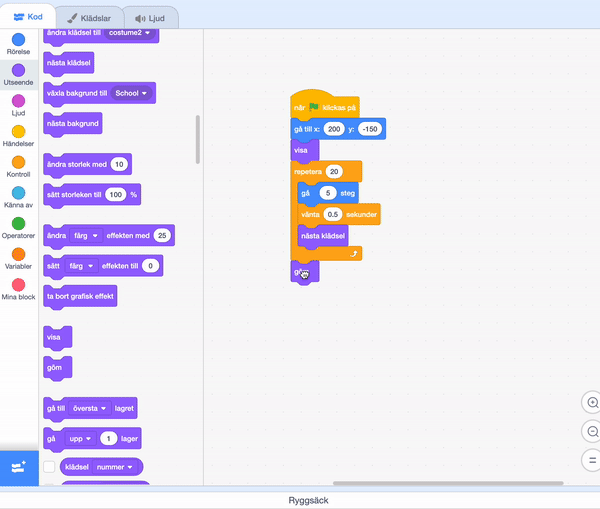

## Missar bussen

<div style="display: flex; flex-wrap: wrap">
<div style="flex-basis: 200px; flex-grow: 1; margin-right: 15px;">
Tänk om Scratchkatten inte sprang snabbt nog för att hinna bussen.
</div>
<div>

{:width="300px"}

</div>
</div>

### Få Scratchkatten att missa bussen

--- task ---

Välj **Scratchkatt**sprajten och lägg till ett `vänta`{:class="block3control"}block:


```blocks3
when flag clicked
go to x:(200) y:(-150) 
show
repeat (20) // try different numbers
move (5) steps 
next costume 
+ wait (1) seconds
end
hide
```
--- /task ---

--- task ---

**Test:** Klicka på den gröna flaggan. Scratchkatten kommer gå för långsamt och missa bussen!

--- /task ---

### Få Scratchkatten att hinna med bussen

--- task ---

Du kommer vilja ha fördröjningar på mindre än en sekund. 0,5 är en halv sekund, 0,25 är en kvarts sekund och 0,1 är en tiondels sekund.

Ändra fördröjningen i `vänta`{:class="block3control"}blocket:


```blocks3
wait (0.2) seconds // try 0.1, 0.5, 0.05
```

**Test:** Klicka på den gröna flaggan så kommer Scratchkatten att gå fortare. Välj den fördröjning som du gillar mest.

--- /task ---

### Välj om Scratchkatten hinner med eller missar bussen

--- task ---

Om du vill att Scratchkatten ska **missa bussen**, ta bort `dölj`{:class="block3looks"}blocket från din kod så att Scratchkatten är kvar på scenen:




```blocks3
when flag clicked
go to x:(200) y:(-150) 
show
repeat (20) 
move (5) steps 
next costume
wait (0.5) seconds 
end
-hide
```
--- /task ---

--- task ---

Om du vill att Scratchkatten ska **hinna med bussen**, låt bussen vänta längre innan den går:


```blocks3
when flag clicked 
+wait [4] seconds // change from 4 to 6
glide [2] secs to x: [320] y: [-100] // right-hand side of the Stage
hide
```

Du kommer behöva sätta tillbaka `dölj`{:class="block3looks"}blocket i **Scratchkatt**sprajtens kod om du har tagit bort den och vill att Scratchkatten ska lyckas hinna med bussen.

--- /task ---

--- task ---

Gör ändringar tills du får animeringen att fungera som du vill.

--- /task ---

<p style="border-left: solid; border-width:10px; border-color: #0faeb0; background-color: aliceblue; padding: 10px;">
När du arbetar med ett projekt går du ofta tillbaka och ändrar eller förbättrar din kod när du får nya idéer. 
</p>


