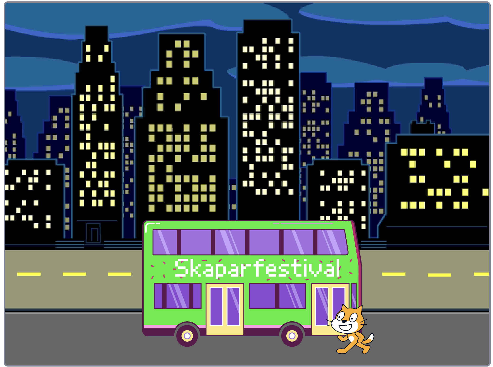
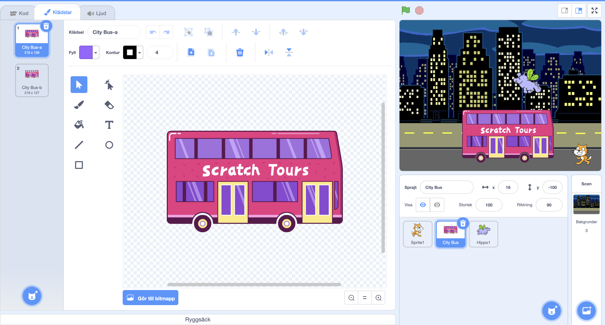
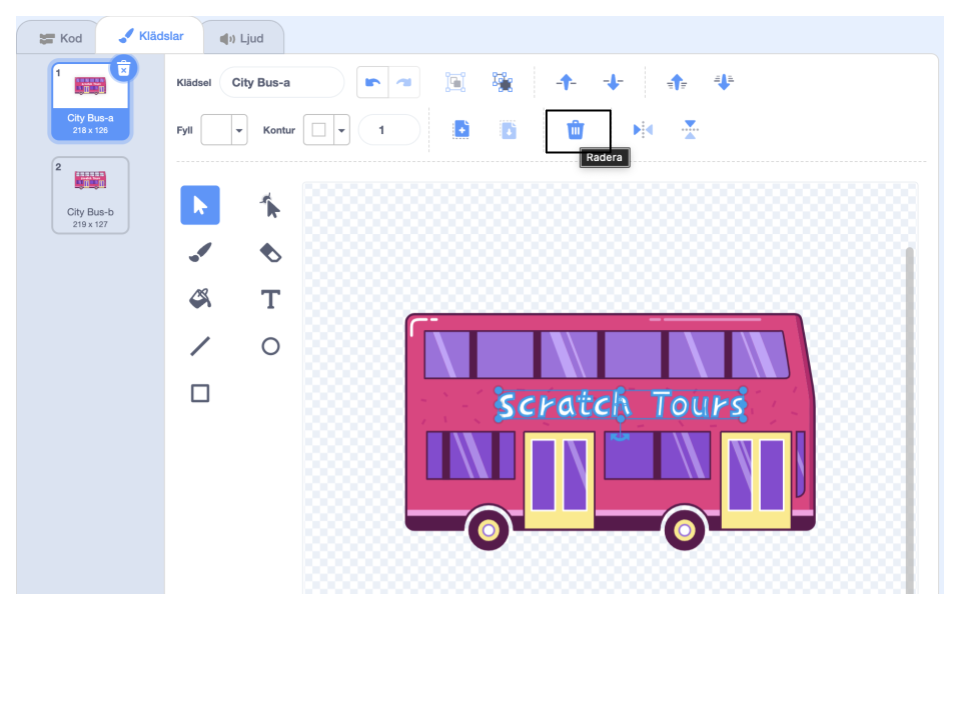
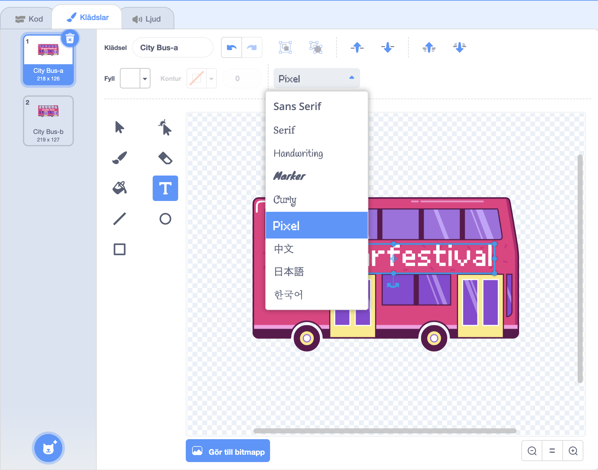
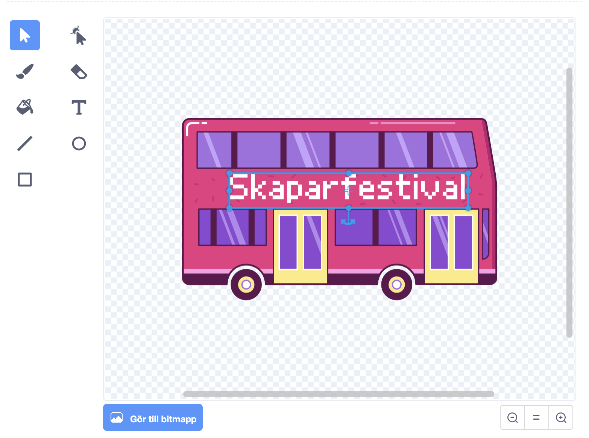

## Ändra destinationen

Skriften på bussen säger "Scratch Tours" men du kan ändra destinationen till något annat om du vill. Vart vill du att din buss ska åka?  

{:width="300px"}

### Redigera stadsbusssprajten

--- task ---

Välj **Stadsbuss**sprajten och klicka på fliken **klädslar**:

--- /task ---

--- task ---

Klicka på den vita "Scratch Tours"-texten för att välja den och klicka sedan på **Radera** för att ta bort den.

**Tips:** Du kan använda **Radera**ikonen i färgredigeraren eller <kbd>Delete</kbd> -tangenten på tangentbordet.

--- /task ---

--- task ---

Välj verktyget **Text** (skriv).

Klicka på bussen där du vill att din text ska börja och skriv in destinationen.

För att ändra teckensnitt (skrivstil) kan du klicka på rullgardinsmenyn **teckensnitt**:

--- /task ---

--- task ---

Klicka på verktyget **Välj** (pil) och dra sedan i texten för att placera den på bussen.

--- /task ---

