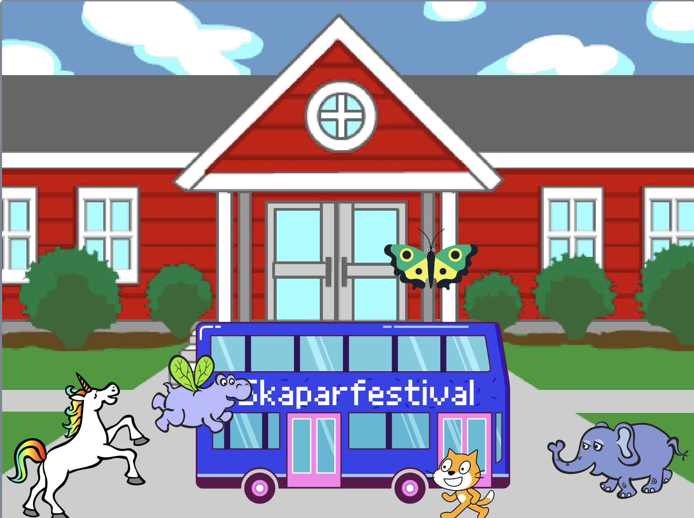

## Uppgradera ditt projekt

Nu kan du lägga till en valfri sprajt i din animering. Du måste lägga till kod för att få din sprajt att `gå till`{:class="block3motion"} en startposition, `peka`{:class="block3motion"} i rätt riktning och sedan `repetera`{:class ="block3control"} `röra sig`{:class="block3motion"}- och `nästa klädsel`{:class="block3looks"}block för att nå bussen.

**Tips:** När du klickar på **Välj en sprajt**kan du hålla muspekaren över en sprajt för att se dess klädslar, eller på vissa mobila enheter kan du trycka och hålla på en sprajt för att se dess klädlsar (om ett fönster dyker upp när du trycker och håller på en sprajt, tryck på sidan av skärmen för att stänga fönstret och se klädslarna). Att titta på sprajters klädslar kan göra det lättare att hitta en sprajt som passar till din animering.

{:width="300px"}

Du kan använda alla block som du lärde dig om i det här projektet, såväl som de som du redan känner till:

```blocks3
when flag clicked

go to x: [0] y: [0] // drag the sprite to choose x and y

show

hide

glide [2] secs to x: [0] y: [-100] // bottom middle of the Stage

repeat [30]
end

point towards (City Bus v)

point in direction (180) // point down

set rotation style [left-right v]

move [3] steps

next costume

start sound [clown honk v]

wait [0.1] seconds // short delay

set [color v] effect to [50] // up to 200
```

--- collapse ---
---
titel: Avslutat projekt
---

Du kan se det [avslutade projektet här](https://scratch.mit.edu/projects/724160134/){:target="_blank"}.

--- /collapse ---

Du kan även "remixa" projektet för att förändra det. Du kan lägga till ljudeffekter till bussen eller andra sprajter samt ställa in färgeffekter på bussen. En av sprajterna skulle kunna missa bussen och inte dölja sig.

Tack till digitalskaparen Lyla för att du skickade denna fantastiska uppgradering!


--- save ---
