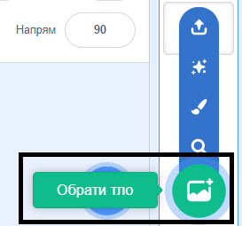

## Створити автобусну сцену

<div style="display: flex; flex-wrap: wrap">
<div style="flex-basis: 200px; flex-grow: 1; margin-right: 15px;">
Вибери тло та додай спрайт автобуса.
</div>
<div>

{:width="300px"}

</div>
</div>

### Відкрий початковий проєкт

--- task ---

Відкрий [Стартовий проєкт Встигнути на автобус](https://scratch.mit.edu/projects/582214330/editor){:target="_blank"}. Scratch відкриється в іншій вкладці браузера.

[[[working-offline]]]

--- /task ---

### Обери тло

--- task ---

Натисни (якщо на планшеті - торкнись) на **Обрати тло** на панелі Сцени (у правому нижньому куті екрана):



--- /task ---

--- task ---

Клацни на категорію **Поза приміщеннями**. Додай тло, яке стане гарною стартовою точкою для твого автобуса:


--- /task ---

### Обери спрайт

--- task ---

Клацни на **Обрати спрайт**:


--- /task ---

--- task ---

Введи `bus` у полі пошуку вгорі:


Додай спрайт **City Bus** до твого проєкту.

--- /task ---

### Дай твоєму автобусу стартову позицію

--- task ---

Переконайся, що спрайт **City Bus** вибрано у списку Спрайтів під Сценою.

Перетягни блок `коли зелений прапорець натиснуто`{:class="block3events"} з меню блоків `Події`{:class="block3events"} до Області коду:


```blocks3
when flag clicked
```

--- /task ---

--- task ---

Перетягни автобус у правильне місце на Сцені:


Координати (цифри, які використовуються для позначення позиції) **x** та **y** автобуса показані на панелі Спрайтів під Сценою:


--- /task ---

--- task ---

Додай блок `перемістити в x: y:`{:class="block3motion"}:


```blocks3
when flag clicked
+go to x: (0) y: (-100)
```

Цифри у блоці `перемістити в x: y:`{:class="block3motion"} - це поточні координати автобуса по x та y. Цифри у твоєму проєкті можуть бути трохи іншими.

--- /task ---

--- task ---

**Тест:** Перетягни автобус в будь-яке місце на сцені, а потім натисни на зелений прапорець. Автобус завжди повинен повертатися у початкову позицію.


--- /task ---

### Переміщай автобус позаду спрайтів персонажів

--- task ---

Аби переконатися в тому, що спрайт **City Bus** буде завжди знаходитися позаду всіх спрайтів персонажів, додай `помістити на передній план`{:class="block3looks"}, потім натисни на `передній`{:class="block3looks"} та зміни його на `задній`{:class="block3looks"}:


```blocks3
when flag clicked
go to x: (0) y: (-100)
+ go to [back v] layer
```

**Порада:** Якщо ти не бачиш блок `помістити на передній план`{:class="block3looks"}, необхідно прокрутити вниз у блоці меню `Вигляд`{:class="block3looks"}.

--- /task ---

### Зміна кольору автобуса

--- task ---

Ти можеш змінити колір автобуса:


```blocks3
when flag clicked
go to x: (0) y: (-100)
go to [back v] layer
+set [color v] effect to (50) // спробуй числа до 200
```

--- /task ---

### Зміна розміру кота Scratch

--- task ---

Котик Scratch з'являється у всіх нових проєктах Scratch у вигляді **Спрайт1** у списку Спрайтів. Натисни на спрайт **Спрайт1** у списку Спрайтів, щоб почати анімувати кота Scratch:


**Порада:** Якщо випадково був видалений **Спрайт1** (Кіт Scratch) ти можеш натиснути на іконку **Обрати спрайт** та ввести у пошук `cat`.

--- /task ---

--- task ---

На панелі Спрайтів, натисни на властивість **Розмір** та зміни розмір кота Scratch на `50`:


--- /task --- 
