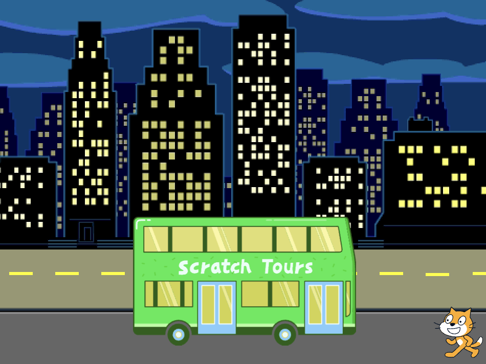

## Кіт Scratch ловить автобус

<div style="display: flex; flex-wrap: wrap">
<div style="flex-basis: 200px; flex-grow: 1; margin-right: 15px;">
Додай анімацію коту Scratch, щоб він з'явився на **правій стороні** Сцени та йшов до автобуса, повторюючи невеликі рухи багато разів по **циклу**. 
</div>
<div>

{:width="300px"}

</div>
</div>

### Встанови коту Scratch Cat початкову позицію

--- task ---

Натисни на властивість **Напрям** на панелі Спрайтів. Поверни стрілку, щоб вказати на `-90`. Далі, натисни на іконку **Зліва-направо** посередині, щоб змінити стиль обертання на `вліво-вправо`, аби Кіт Scratch не перевертався догори ногами:


--- /task ---

--- task ---

Перетягни кота Scratch'а в нижню праву частину Сцени.



**Порада:**Якщо ти спробуєш розмістити спрайт за межами Сцени, він повернеться на свою останню позицію.

--- /task ---

--- task ---

Додай код, щоб повернути кота у його початкову точку:


```blocks3
when flag clicked
go to x:(200) y:(-150) // нижній правий кут
```

--- /task ---

--- task ---

**Тест:** Перетягни Кота Scratch на нову позицію, а потім клацни на блок `перемістити в x: y:`{:class="block3motion"}. Кіт Scratch повинен кожного разу повертатися в нижню праву сторону.

--- /task ---

### Анімація кота Scratch

Ти будеш додавати код в цикл `повторити`{:class="block3control"}, щоб змусити кота Scratch повторювати невелику кількість кроків багато разів. Це зробить кота Scratch анімованим.

--- task ---

Додай блок `повторити`{:class="block3control"} `10`, потім перетягни всередині нього блок `перемістити на`{:class="block3motion"} `10` `кроків`{:class="block3motion"}:


```blocks3
when flag clicked
go to x:(200) y:(-150) // нижній правий кут
+ repeat (10) // спробуй різні числа
move (5) steps //  5 - це хороша швидкість ходьби
end
```

--- /task ---

--- task ---

**Тест:** Натисни на зелений прапорець. Пробуй змінювати цифри у блоці `повторити`{:class="block3control"} `10`, щоб Кіт Scratch зупинився біля автобуса.

--- /task ---

Деякі спрайти мають більше одного образа. Ти будеш використовувати образ спрайта **Scratch Cat**, щоб створити анімацію прогулянки кота Scratch.

--- task ---

Натисни на вкладку **Образи**. Спрайт **Scratch Cat** має два образи, і разом, вони можуть бути використані для створення анімації ходьби.

--- /task ---

--- task ---

Натисни на вкладку **Код**. Натисни на блок `наступний образ`{:class="block3looks"}:


```blocks3
when flag clicked
go to x:(200) y:(-150) // нижній правий кут
repeat (20) // спробуй різні числа
move (5) steps //  5 - це хороша швидкість ходьби
+ next costume 
end
```
--- /task ---

--- task ---

**Тест:** Натисни на зелений прапорець та Кіт Scratch буде йти до автобуса.

--- /task ---

### Сховай кота Scratch

--- task ---

Додай блок, щоб `приховати`{:class="block3looks"} кота Scratch Cat, коли він дійде до автобуса:


```blocks3
when flag clicked
go to x:(200) y:(-150) // нижній правий кут
repeat (20) // спробуй різні числа
move (5) steps //  5 - це хороша швидкість ходьби
next costume 
end
+ hide
```

--- /task ---

--- task ---

**Тест:** Клацни на зелений прапорець ще раз, і ти побачиш, що Кіт Scratch зник.

--- /task ---

### Покажи кота Scratch

--- task ---

Додай блок `показати`{:class="block3looks"}, щоб Кіт Scratch з'явився до того, як він почне йти до автобуса:


```blocks3
when flag clicked
go to x:(200) y:(-150) // нижній правий кут
+ show
repeat (20) // спробуй різні числа
move (5) steps //  5 - це хороша швидкість ходьби
next costume 
end
hide
```

**Порада:** Коли ти використовуєш блок `сховати`{:class="block3looks"}, потрібно також додати блок `показати`{:class="block3looks"}, щоб спрайт відображався тоді, коли це необхідно.

--- /task ---

--- task ---

**Тест:** Клацни на зелений прапорець, щоб протестувати свій проєкт та переконатися, що Кіт Scratch показався.

--- /task ---

