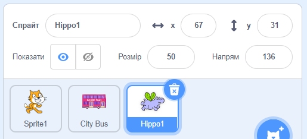

## Бегемот летить до автобуса

<div style="display: flex; flex-wrap: wrap">
<div style="flex-basis: 200px; flex-grow: 1; margin-right: 15px;">
Додай спрайт бегемотика, який підлітає до автобуса.
</div>
<div>

{:width="300px"}

</div>
</div>

### Задай Бегемоту стартову позицію

--- task ---

Додай спрайт **Hippo1** до твого проєкту.

Зміни **Розмір** спрайта **Hippo1**:



--- /task ---

--- task ---

Перетягни бегемотика у верхній лівий кут сцени.


--- /task ---

--- task ---

Додай код, щоб бегемотик повертався у вихідну позицію:

```blocks3
when flag clicked
go to x: [-200] y: [150] // top left-hand side
```

**Порада:** Координати `x`{:class="block3motion"} та `y`{:class="block3motion"} у блоці `перемістити в x: y`{:class="block3motion"} будуть відповідати поточним координатам бегемотика, тому вводити їх вручну не потрібно.

--- /task ---

### Зроби так, щоб Бегемотик змахнув крилами й полетів

--- task ---

Додай код, щоб бегемотик полетів у бік **Громадського автобуса**:

```blocks3
when flag clicked
go to x: [-200] y: [150] 
+repeat [100] 
point towards (City Bus v) // change from mouse-pointer
move [3] steps
next costume
+end
```

--- /task ---

--- task ---

**Тест:** Клацни на зелений прапорець та перевір, що бегемотик летить до автобуса. Ти можеш змінити номер у блоці `повторити`{:class="block3control"}, щоб бегемотик зупинився у потрібному тобі місці.

--- /task ---

### Показати та приховати автобус

--- task ---

Додай блоки `показати`{:class="block3looks"} та `приховати`{:class="block3looks"}:

```blocks3
when flag clicked
go to x: [-200] y: [150] 
+ show
repeat [90] 
point towards (City Bus v)
move [3] steps
next costume
end
+ hide
```

--- /task ---

--- task ---

**Тест:** Натисни на зелений прапорець. Бегемотик полетить та зайде в автобус.

--- /task ---
