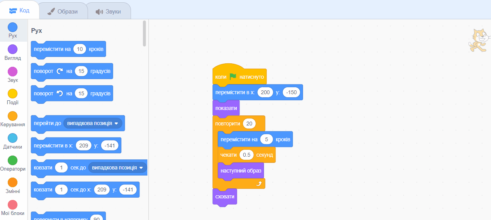

## Запізнення на автобус

<div style="display: flex; flex-wrap: wrap">
<div style="flex-basis: 200px; flex-grow: 1; margin-right: 15px;">
Але якщо Кіт Scratch не встиг добігти до автобуса?
</div>
<div>

{:width="300px"}

</div>
</div>

### Зроби так, щоб кік Scratch запізнився на автобус

--- task ---

Вибери спрайт**Scratch Cat** та додай блок `чекати`{:class="block3control"}:


```blocks3
when flag clicked
go to x:(200) y:(-150) 
show
repeat (20) // try different numbers
move (5) steps 
next costume 
+ wait (1) seconds
end
hide
```
--- /task ---

--- task ---

**Тест:** Натисни на зелений прапорець. Кіт Scratch буде йти занадто повільно та запізниться на автобус!

--- /task ---

### Зроби так, щоб Кіт Scratch встиг на автобус

--- task ---

Тут потрібні затримки менше однієї секунди. 0,5 - пів секунди, 0,25 - чверть секунди, 0,1 - десята частина секунди.

Зміни затримку в блоці `чекати`{:class="block3control"}:


```blocks3
wait (0.2) seconds // try 0.1, 0.5, 0.05
```

**Тест:** Натисни на зелений прапорець і Кіт Scratch буде крокувати швидше. Вибирай затримку, яка тобі найбільше до вподоби.

--- /task ---

### Вибирай - встигне Кіт Scratch на автобус, чи запізниться на нього

--- task ---

Якщо ти хочеш, щоб Кіт Scratch **запізнився на автобус**, видали блок `приховати`{:class="block3looks"} з твого коду так, щоб Кіт Scratch залишився на Сцені:




```blocks3
when flag clicked
go to x:(200) y:(-150) 
show
repeat (20) 
move (5) steps 
next costume
wait (0.5) seconds 
end
-hide
```
--- /task ---

--- task ---

Якщо ти хочеш, щоб Кіт Scratch **встигнув на автобус**, зроби так, щоб автобус чекав довше, перш ніж він поїде:


```blocks3
when flag clicked 
+wait [4] seconds // change from 4 to 6
glide [2] secs to x: [320] y: [-100] // right-hand side of the Stage
hide
```

Тобі потрібно буде встановити назад блок `приховати`{:class="block3looks"} до коду спрайта **Scratch Cat**, якщо ти видаляв, але хочеш, щоб Кіт Scratch встигнув на автобус.

--- /task ---

--- task ---

Внеси зміни до тих пір, поки не отримаєш анімацію, яка буде працювати так, як ти хочеш.

--- /task ---

<p style="border-left: solid; border-width:10px; border-color: #0faeb0; background-color: aliceblue; padding: 10px;">
Працюючи над проєктом, ти часто повертаєшся назад і змінюєш або вдосконалюєш свій код, оскільки у тебе з'являються нові ідеї. 
</p>


