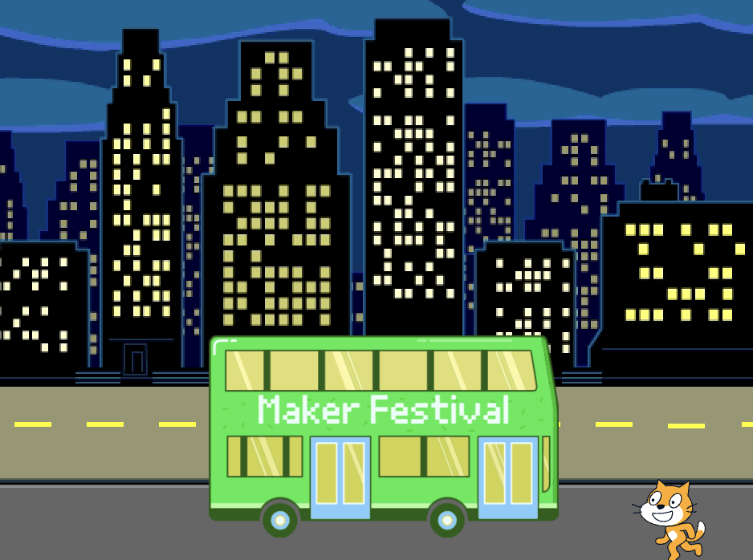
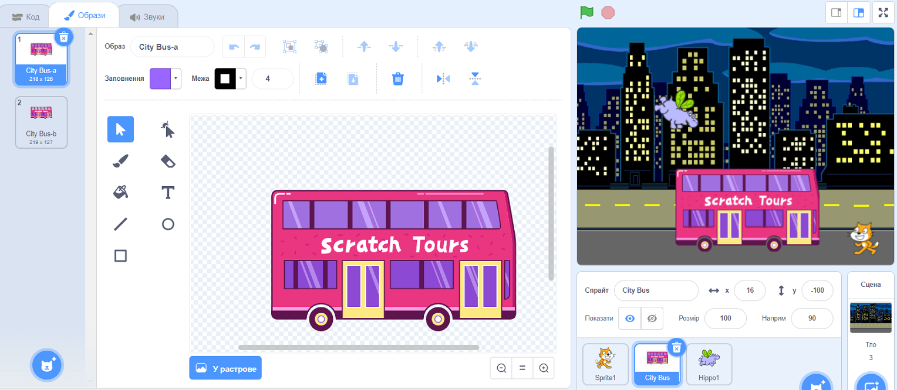
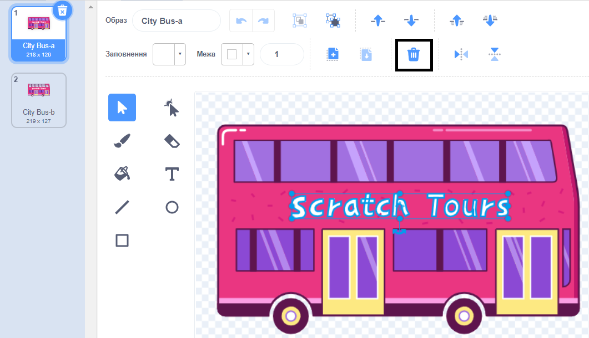
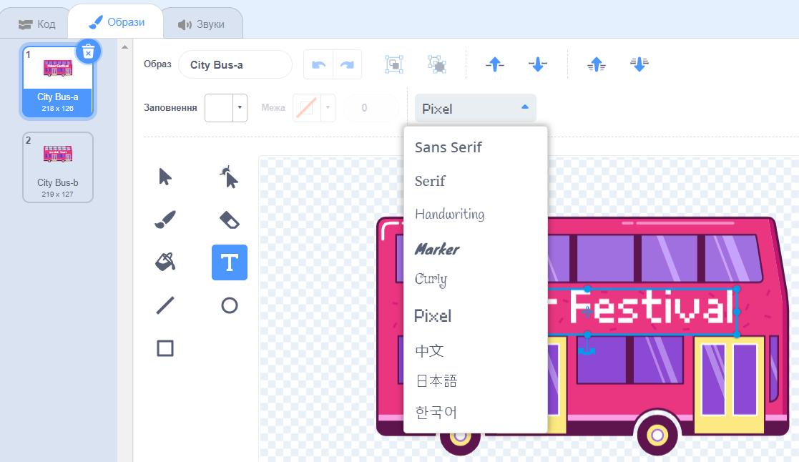

## Зміна пункту призначення

На автобусі написано "Scratch Tours", але ти можеш це змінити, на твій вибір. Куди ти хочеш, щоб твій автобус поїхав?  

{:width="300px"}

### Редагування спрайта автобуса

--- task ---

Вибери спрайт**City Bus** та натисни на вкладку **Образи**:

--- /task ---

--- task ---

Натисни на білий текст "Scratch Tours", щоб вибрати його, та натисни на **Вилучити**, щоб видалити його.

**Порада:** Ти можеш скористатися іконкою **Вилучити** у редакторі Малювання або клавішею <kbd>Delete</kbd> на клавіатурі.

--- /task ---

--- task ---

Вибери інструмент**Текст** (написати).

Натисни на місце автобуса, де ти хочеш, щоб починався твій текст, і введи назву обраного тобою пункту призначення.

Щоб змінити шрифт (стиль написання), можна натиснути на спливаюче меню **Шрифт**:

--- /task ---

--- task ---

Натисни на інструмент **Обрати** (Стрілка), а потім перетягни текст, щоб розташувати його на автобусі.

--- /task ---

