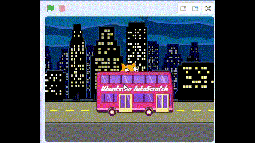

## Yenza owakho umboniso

<div style="display: flex; flex-wrap: wrap">
<div style="flex-basis: 200px; flex-grow: 1; margin-right: 15px;">
Khetha umfanekiso wangemva kwaye ufake ne si-sprite esiyi bhasi.
</div>
<div>

{:width="300px"}

</div>
</div>

### Vula iprojekthi yokuqalisa

--- task ---

Vula [iprojekthi yokuqalisa ethi Leqa ibhasi](https://scratch.mit.edu/projects/582214330/editor){:target="_blank"}. uScratch uya kuvula kwenye ithebhu yesikhangeli.

[[[working-offline]]]

--- /task ---

### Khetha umfanekiso wangasemva

--- task ---

Cofa (okanye kwithebhulethi, chwetha) ku **Khetha umfanekiso wangemva** kwisahlulo seqonga (kwikona esezantsi ekunene kwekhusi):


--- /task ---

--- task ---

Cofa kudididi lwa**Ngaphandle**. Yongeza umfanekiso wangemva ozakwenza isiqalo esihle sebhasi yakho:


--- /task ---

### Khetha iSprite

--- task ---

Cofa ku **Khetha i-Sprite**:


--- /task ---

--- task ---

Chwetheza `ibhasi` kwibhokisi yokukhangela phezulu:


Yongeza **Ibhasi yeSixeko** esisprite kwiprojekthi yakho.

--- /task ---

### Nika ibhasi yakho indawo yokuqala

--- task ---

Qinisekisa ukuba isprite esiy**Ibhasi yesiXeko** sikhethiwe kuluhlu lwezi-Sprite ngezantsi kweqonga.

Tsala ibhlokhi ethi `xa iflegi eluhlaza icofiwe`{:class="block3events"} esuka kwiibhloko zemenyu `Iziganeko`{:class="block3events"} uyibeke kwindawo yeKhowudi:


```blocks3
when flag clicked
```

--- /task ---

--- task ---

Tsala ibhasi uyibeke kwindawo elungileyo eqongeni:


Ulungelelaniso luka-**x** kunye no-**y** (amanani asetyenzisiweyo ukuchaza indawo) yebhasi abonisiwe kwipheyini ye-Sprite ngezantsi kweQonga:


--- /task ---

--- task ---

Yongeza ibhloko ka `yiya ku-x: y:`{:class="block3motion"}:


```blocks3
when flag clicked
+go to x: (0) y: (-100)
```

Amanani akwibhloki `yiya ku-x: y:`{:class="block3motion"} amelane nolungelelwaniso luka-x kunye no-y lwebhasi. Amanani kwiprojekthi yakho anokwahluka.

--- /task ---

--- task ---

**Uvavanyo:** Tsala ibhasi ukuya naphi na eQongeni, emva koko ucofe kwiflegi eluhlaza. Ibhasi kufuneka isoloko isiya kwindawo yayo yokuqala.



--- /task ---

### Hambisa ibhasi iyemva kwe-sprites zabalinganiswa

--- task ---

Ukuqinisekisa ukubaisprite **Ibhasi yeSixeko** sisoloko singasemva kwabo bonke abalinganiswa, faka ibhulokhi `yiya kumaleko ongaphambili` ulandele ngokucofa `phambili`{:class="block3looks"} uyitshinste ngokucofa `umva`{:class="block3looks"}:


```blocks3
when flag clicked
go to x: (0) y: (-100)
+ go to [emva v] layer
```

**Ingcebiso:** Ukuba awukwazi ukubona ibhloki ethi `yiya kumaleko ongaphambili`{:class="block3looks"}, kumele uskrole uye ezantsi kwimenyu blokhi `Imbhonakalo`{:class="block3looks"}.

--- /task ---

### Tshintsha umbala webhasi

--- task ---

Ungawutshintsha umbala webhasi:


```blocks3
when flag clicked
go to x: (0) y: (-100)
go to [emva v] layer
+set [umbala v] effect to (50) // zama amanani ukuya kuma- 200
```

--- /task ---

### Tshintsha ubungakanani bekati kaScratch

--- task ---

Ikati kaSprite ibonakala kuzo zonke iiprojekthi zeScratch ezintsha njenge **Sprite1** kuluhlu lweSprite. Cofa kwi **Sprite1** sprite kuluhlu lweSprite ukuze ulungele ukwenza upopayi kweSprite seKati:


**Ingcebiso:** Ukuba ucime ngempazamo isprite u**Sprite1** (ikati kaScratch), unga cofa ku **Khetha i-Sprite** ukhangele u`kati`.

--- /task ---

--- task ---

Kwipheyini yeSprite, cofa **Ubungakanani** ipropathi kwaye utshintshe ubungakanani beScratch Cat uyenze u`50`:


--- /task --- 
