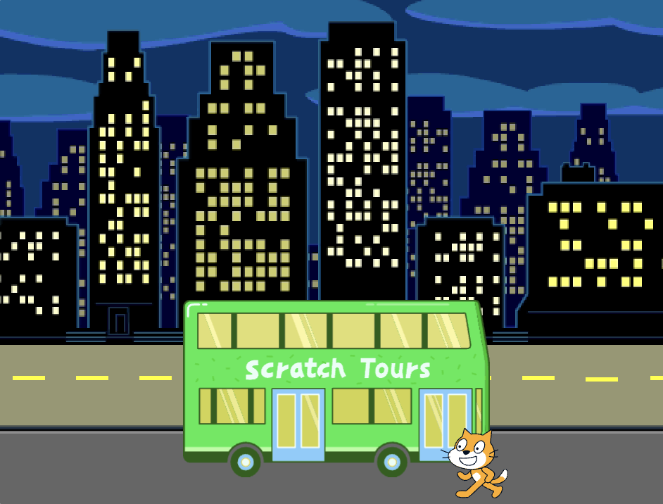
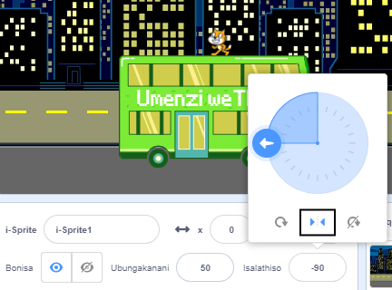
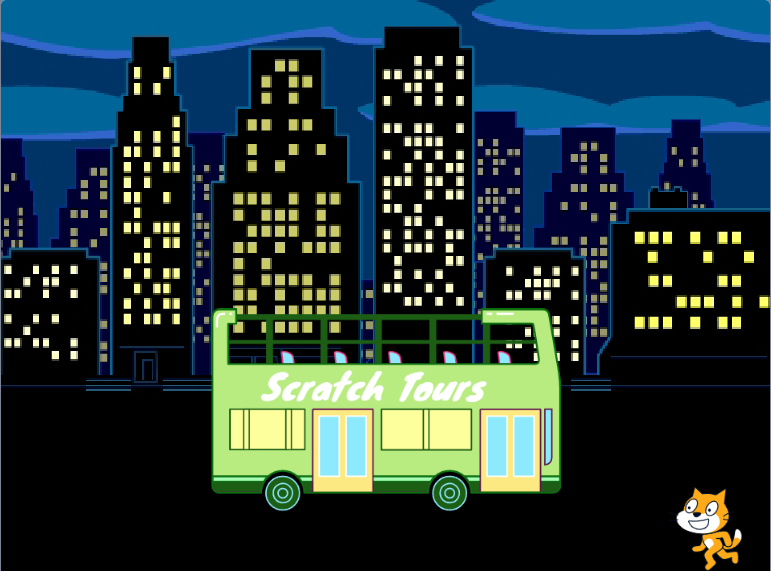

## Ikati kaScratch ileqa ibhasi

<div style="display: flex; flex-wrap: wrap">
<div style="flex-basis: 200px; flex-grow: 1; margin-right: 15px;">
Yenza iKati ka Scratch ibonakale **kwisandla sasekunene** seqonga kwaye uhambe uye ebhasini ngokuphinda intshukumo encinci kaninzi ku**phindaphhindwano**. 
</div>
<div>

{:width="300px"}

</div>
</div>

### Yisa iKati kaScratch kwindawo yayo yokuqala

--- task ---

Cofa ipropathi **Umolwathiso** kwipheyini yeSprite. Jikelezisa utolo lwalathe ku `-90`. Emva koko, cofa umboniso **Ekhohlo/Ekunene** embindini ukuze utshintsha indlela sokujikelezisa ukuya `ekhohlo-ekunene` ukuze iKati kaScratch ingajongi ezantsi:



--- /task ---

--- task ---

Tsala iKati kaScratch ukuya kwicala lasekunene le-Qonga.



**Ingcebiso:** Ukuba uzama ukubeka i-sprite ngaphandle kwiQonga, iyakubuyela emva kwindawo yayo yokugqibela eQongeni.

--- /task ---

--- task ---

Yisa iKati kaScratch kwindawo yayo yokuqala:


```blocks3
when flag clicked
go to x:(200) y:(-150) // bottom right-hand side
```

--- /task ---

--- task ---

**Uvavanyo:** Tsala iKati KaScratch uyise kwindawo entsha, emva koko ucofe kweyakho ibhloki `uye ku-x: y:`{:class="block3motion"}. Ikati kaScratch kufuneka ibuyele umva kwicala lasekunene ngasekunene rhoqo.

--- /task ---

### Yenza iKati kaScrath upapoyi

Uyakongeza ikhowudi kuphindaphindo elingu `phinda`{:class="block3control"} ukwenza iKati kaScratch iphinde amanyathelo amancinci kaninzi. Oku kuya kwenza iKati kaScratch ibonakale ingupopayi.

--- task ---

Yongeza ibhulokhi `phinda`{:class="block3control"} `10`, kwaye utsale ibhulokhi u`hamba`{:class="block3motion"} `10` `amanyathelo`{:class="block3motion"} phakathi kuyo:


```blocks3
when flag clicked
go to x:(200) y:(-150) // bottom right-hand side
+ repeat (10) // try different numbers
move (5) steps //  5 is a good walking speed
end
```

--- /task ---

--- task ---

**Uvavanyo:** Cofa kwiflegi eluhlaza. Zama ukutshintsha amanani kwibhuloki `phinda`{:class="block3control"} `10` ukuze iKati kaScrath ime ebhasini.

--- /task ---

Ezinye ii-sprites zinempahla engaphezulu kwesinye. Uya kusebenzisa iinkangeleko zesprite **iKati kaScratch** ukwenza upopayi yekati ehambayo.

--- task ---

Cofa kwithebhu **Inkangeleko**. Isprite **Ikati kaScratch** ineenkangeleko ezimbini, kwaye kunye, zingasetyenziselwa ukwenza intshukumo yokuhamba.

--- /task ---

--- task ---

Cofa kwithebhu **Ikhowudi**. Yongeza iblokhi `inkangeleko elandelayo`{:class="block3looks"} phakathi kweblokhi `phinda`{:class="block3control"}:


```blocks3
when flag clicked
go to x:(200) y:(-150) // bottom right-hand side
repeat (20) // try different numbers
move (5) steps //  5 is a good walking speed
+ next costume 
end
```
--- /task ---

--- task ---

**Uvavanyo:** Cofa kwiflegi eluhlaza, ukuze iKati KaScratch ihamba iye ebhasini.

--- /task ---

### Zimelisa iKati kaScratch

--- task ---

Yongeza ibhloko ezaku `fihla`{:class="block3looks"}iKati kaScratch xa ifika ebhasini:


```blocks3
when flag clicked
go to x:(200) y:(-150) // bottom right-hand side
repeat (20) // try different numbers
move (5) steps //  5 is a good walking speed
next costume 
end
+ hide
```

--- /task ---

--- task ---

**Uvavanyo:** Cofa kwiflegi eluhlaza kwakhona, uya kubona ukuba iKati KaScratch ngoku inyamalele.

--- /task ---

### Bonakalisa Kati KaScratch

--- task ---

Yongeza ibhlokhi - `bonisa`{:class="block3looks"} ukuze iKati kaScratch ivele phambi kokuba baye ebhasini:


```blocks3
when flag clicked
go to x:(200) y:(-150) // bottom right-hand side
+ show
repeat (20) // try different numbers
move (5) steps //  5 is a good walking speed
next costume 
end
hide
```

**Ingcebiso:** Xa usebenzisa ibhlokhi `fihla`{:class="block3looks"}, kufuneka ufake ibhlokhi `bonisa`{:class="block3looks"} ukuze uqinisekise ukuba isprite siyabonakala xa kudingeka sibonakale.

--- /task ---

--- task ---

**Uvavanyo:** Cofa kwiflegi eluhlaza ukuvavanya iprojekthi yakho, kwaye uqinisekise ukuba iKati kaScratch iyavela.

--- /task ---

