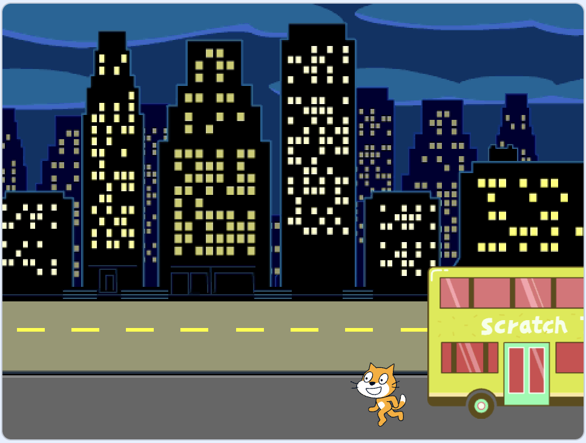
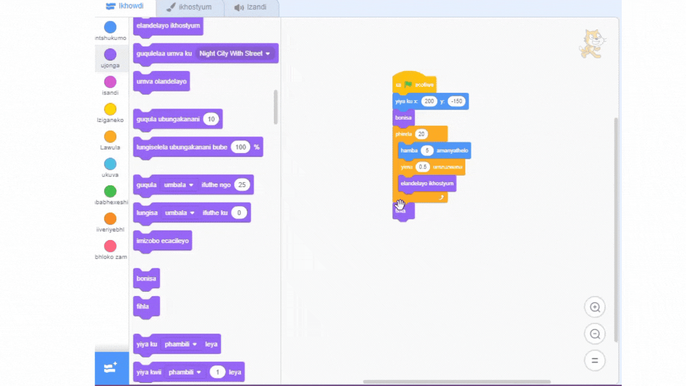
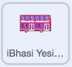

## Ukushiywa yibhasi

<div style="display: flex; flex-wrap: wrap">
<div style="flex-basis: 200px; flex-grow: 1; margin-right: 15px;">
Kungathini ukuba Ikati ka-Scratch ayikwazanga ukubaleka ifumane ibhasi?
</div>
<div>

{:width="300px"}

</div>
</div>

### Yenza iKati kaScratch ishiyiwe yibhasi

--- task ---

Khetha i-sprite esiyi**Kati kaScratch** kwaye wongeze ibhloki `linda`{:class="block3control"}:


```blocks3
when flag clicked
go to x:(200) y:(-150) 
show
repeat (20) // try different numbers
move (5) steps 
next costume 
+ wait (1) seconds
end
hide
```
--- /task ---

--- task ---

**Uvavanyo:** Cofa kwiflegi eluhlaza. Ikati kaSrcatch iya kuhamba kancinci kwaye ishiywe yibhasi!

--- /task ---

### Yenza iKati kaSratch ikhwele iBhasi

--- task ---

Uya kufuna ulibaziseko olungaphantsi komzuzwana omnye. i- 0.5 sisiqingatha somzuzwana, i- 0.25 yikota yomzuzwana, kwaye i- 0.1 lishumi lomzuzwanai.

Tshintsha ulibaziseko kw ibhloki `linda`{:class="block3control"}:


```blocks3
wait (0.2) seconds // try 0.1, 0.5, 0.05
```

**Uvavanyo:** Cofa kwiflegi eluhlaza, ukuze iKati KaScratch ihamba iye ebhasini. Khetha ukulibaziseka okuthanda kakhulu.

--- /task ---

### Khetha ukuba iKati kaScrath iyahamba okanye iyashiywa yibhasi

--- task ---

Ukuba ufuna iKati kaScratch<0>ishywe yibhasi</0>, susa ibhlokhi <1>fihla</1>{:class="block3looks"} kwikhowudi yakho ukuze iKati kaScratch ihlale eqongeni:




```blocks3
when flag clicked
go to x:(200) y:(-150) 
show
repeat (20) 
move (5) steps 
next costume
wait (0.5) seconds 
end
-hide
```
--- /task ---

--- task ---

Ukuba ufuna iKati kaScratch `ihambe ne bhasi`, yenza ibhasi ilinde ixesha elide phambi kokuba ihambe:



```blocks3
when flag clicked 
+wait [4] seconds // change from 4 to 6
glide [2] secs to x: [320] y: [-100] // right-hand side of the Stage
hide
```

Kuza kufuneka ubuyisele ibhulokhi `fihla`{:class="block3looks"} emva kwikhowudi yesprit **iKati kaScratch** ukuba uyisusile ukuba ufuna iKati kaScratch ikwelw ngempumelelo ebhasini.

--- /task ---

--- task ---

Yenza utshintsho ude ufumane oopopayi basebenze ngendlela ofuna ngayo.

--- /task ---

<p style="border-left: solid; border-width:10px; border-color: #0faeb0; background-color: aliceblue; padding: 10px;">
Xa usebenza kwiprojekthi, uhlala ubuyela emva uyokutshintsha okanye uyokuphucula ikhowudi yakho njengoko ufumana imibono emitsha. 
</p>


