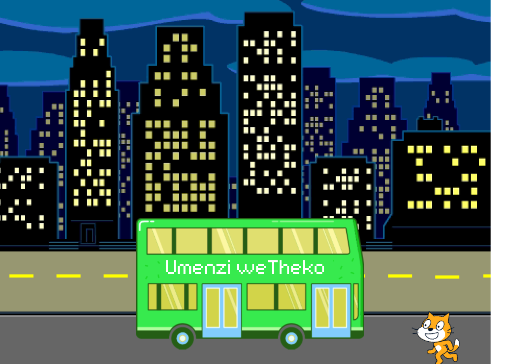
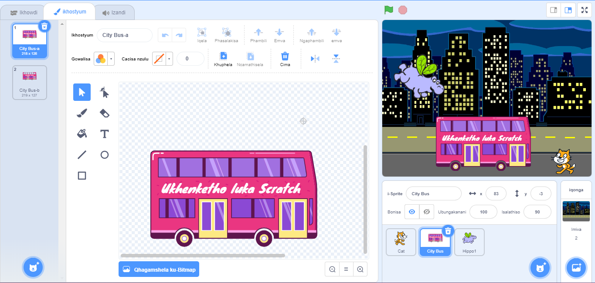
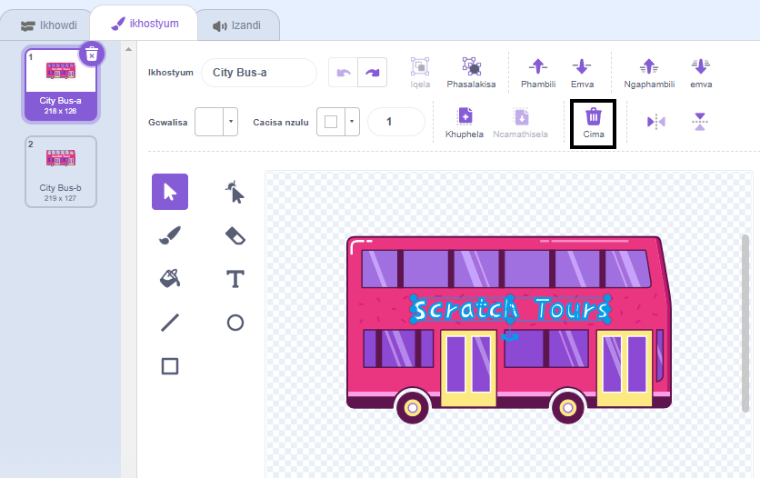
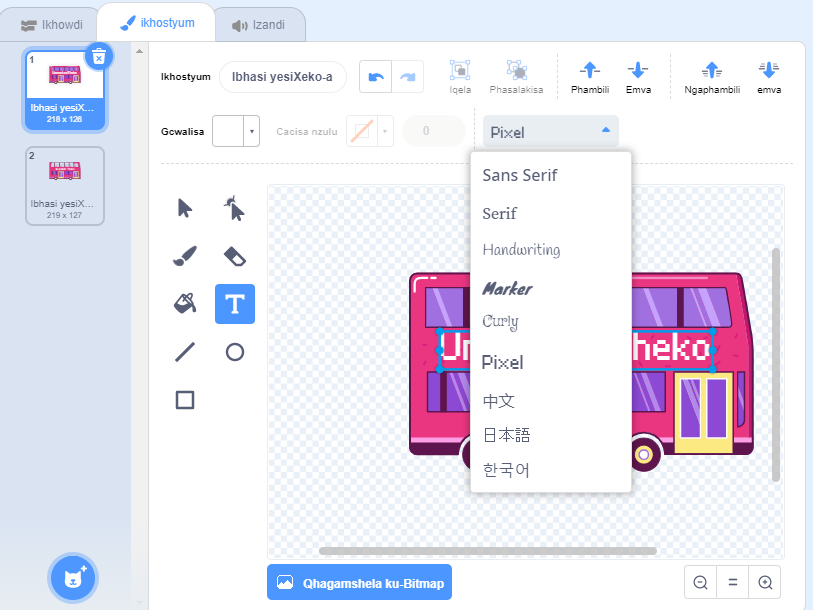
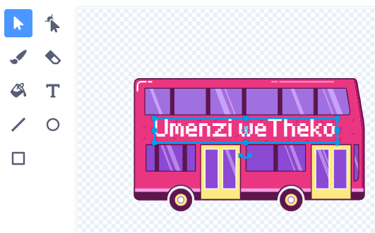

## Tshintsha indawo ekuyiwa kuyo

Umbhalo osebhasini othi "Ukhenketho lukaScratch", ungakwazi ukumtshintsha ubhale nantoni na ethandwa nguwe. Ufuna ibhasi yakho iye phi?  

{:width="300px"}

### Hlela iSprite esiyiBhasi yeSixeko

--- task ---

Khetha isprite esiyi**Ibhasi yeSixeko**, ucofe kwi thebhu ye**Mbonakalo**:

--- /task ---

--- task ---

Cofa kulendawo imhlophe ibhale "Ukhenketho lukaScratch" uwukhethe lombhalo kwaye ucofe ku**Cima** ukuze usuke.

**Ingcebiso:** Ungasebenzi umfanekiso ka**Cima** kwihlelo lepeyinti okanye iqhosha loku <kbd>Cima</kbd> kwisixhaxhazi sakho.

--- /task ---

--- task ---

Khetha isixhobo (sokubhala) **Umbhal0**.

Cofa ibhasi apho ufuna umbhalo wakho aqale khona, ulandelise ngokuxhahxaza indawo ofuna uye kuyo ibhasi.

Ukuze utshintshe ifonti (uhlobo umbhalo okhangeleka ngayo), cofa ku **Fonti** kwehle imenyu:

--- /task ---

--- task ---

Cofa kwisixhobo (utolo) **Khetha**, ke ngoku tsala umbhalo uwubeke ebhasini.

--- /task ---

