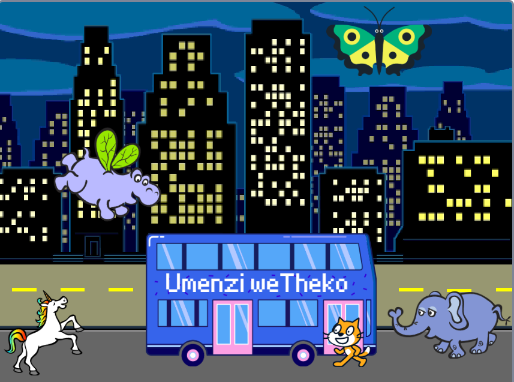

## Phucula iprojekthi yakho

Ngoku, ungongeza isprite esithandwa nguwe kupopayi wakho. Uzakudinga ukufaka ikhowudi ukuze wenze i-sprite sako `siye`{:class="block3motion"} kwindawo yaso yokuqala, `yalatha`{:class="block3motion"} kwicala elifanele, ngoku faka ibhulakhi `phinda`{:class="block3motion"} `hamba`{:class="block3motion"} kwaye ucofe `imbonakalo elandelayo` ukuze ufike kwibhasi.

**Ingcebiso:** Xa ucofa ku**Khetha i-Sprite**, ubeke isalathisi semouse yakho ngaphezulu kwe-sprite ukuze ubone isinxibo sayo, okanye kwezinye izixhobo eziphathwayo, ungacofa kwaye ubambe kwi-sprite ukuze ubone isinxibo sayo (ukuba kuvela ifestile kwaye xa ubambe i-sprite, cofa ecaleni kwesikrini ukuvala ifestile kwaye uzakubona izinxibo). Ukujonga iimpahla ze-sprites kunokukunceda ufumane i-sprite esebenza kakuhle kupopayi.

{:width="300px"}

Ungasebenzisa naziphi na iibhloko ofunde ngazo kule projekthi, kunye nezo sele uzazi:

```blocks3
when flag clicked

go to x: [0] y: [0] // tsala i-sprite ukukhetha u-x kunye no-y

show

hide

glide [2] secs to x: [0] y: [-100] // emazantsi embindini weQonga

repeat [30]
end

point towards (iBhasi YesiXeko v)

point in direction (180) // khomba phantsi

set rotation style [ekhohlo-ekunene v]

move [3] steps

next costume

start sound [clown honk v]

wait [0.1] seconds // ulibaziseko olufutshane

set [umbala v] effect to [50] // ukuya kuthi ga kuma- 200
```

--- collapse ---
---
isihloko: Iprojekthi egqityiweyo
---

Ungajonga [egqityiweyo iprojekthi apha](https://scratch.mit.edu/projects/1147284637/){:target="_blank"}.

--- /collapse ---

Unako kwakhona 'ukuxuba' iprojekthi ukwenza naluphi na utshintsho oluthandayo. Unokongeza iziphumo zesandi ebhasini okanye kwezinye ii-sprites, okanye usete isiphumo sombala webhasi. Enye yee-sprites inokushiywa ibhasi kwaye ingazifihli.

Enkosi kumenzi wedijithali uLyla ngokuthumela olu hlaziyo lumangalisayo!


--- save ---
